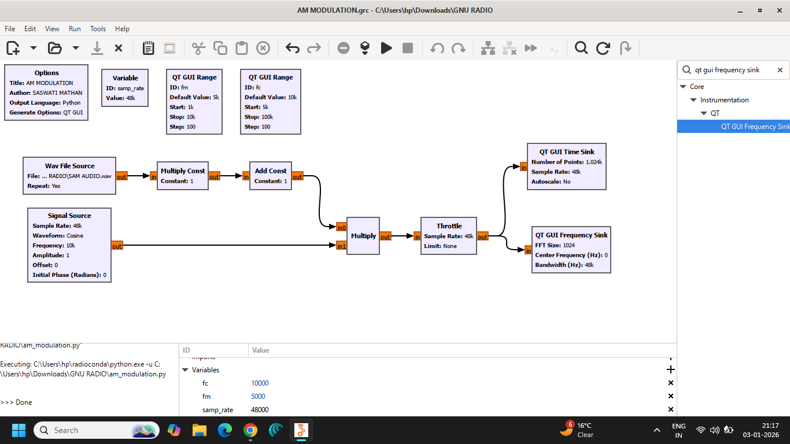
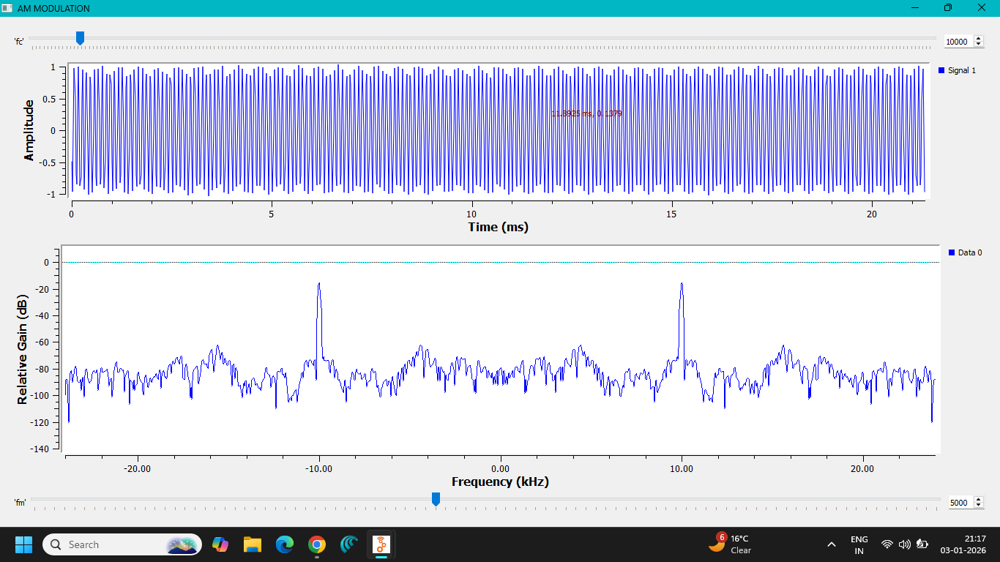
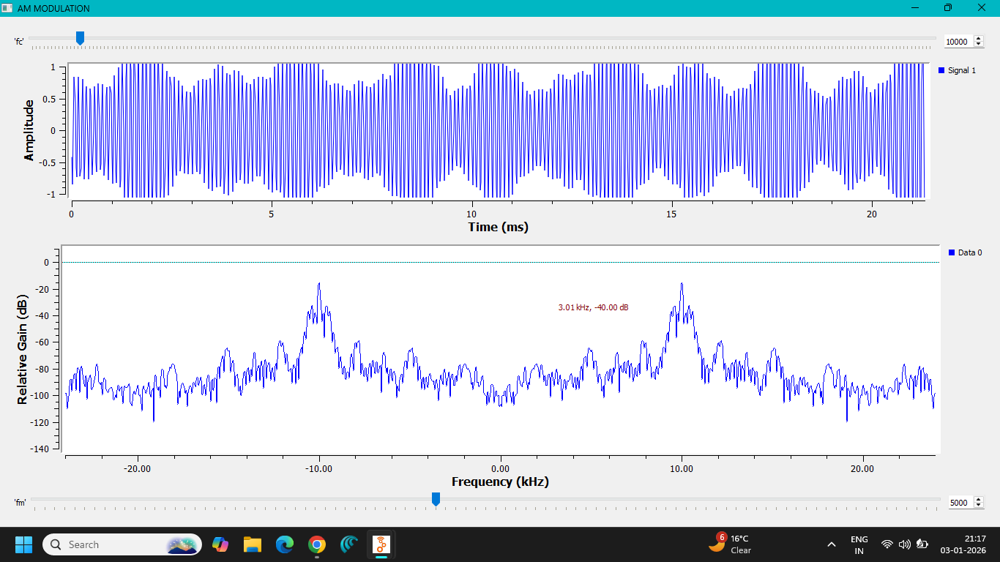
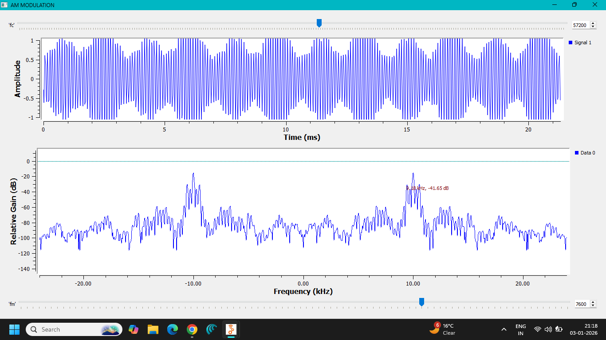

# Lab 01 — Amplitude Modulation (AM)

**Author:** Saswati Anupama Mathan  
**Domain:** Analog Communication / GNU Radio  
**Software:** GNU Radio Companion (GRC)

---

## 1. Aim

To implement and analyze **Amplitude Modulation (AM)** using GNU Radio Companion and observe the modulated signal in both the **time domain** and **frequency domain**.

The experiment demonstrates how the amplitude of a high-frequency carrier is varied according to the instantaneous amplitude of a low-frequency message signal.

---

## 2. Objective

The objectives of this experiment are:

- To understand the fundamental principle of Amplitude Modulation.
- To generate a message/baseband signal.
- To generate a high-frequency carrier signal.
- To perform amplitude modulation of the carrier using the message signal.
- To observe the resulting AM waveform in the time domain.
- To analyze the AM spectrum in the frequency domain.
- To understand the relationship between the message frequency, carrier frequency, and sidebands.
- To study the practical implementation of AM using GNU Radio.

---

# 3. Theory — Amplitude Modulation

## 3.1 What is Modulation?

In communication systems, the information signal or **message signal** generally has a relatively low frequency and cannot always be transmitted efficiently over a communication channel directly.

Therefore, the information signal is used to modify a higher-frequency signal called the **carrier**.

This process is called **modulation**.

The three basic parameters of a sinusoidal carrier that can be varied are:

1. Amplitude
2. Frequency
3. Phase

Depending on which parameter is varied, different modulation techniques are obtained.

For example:

- Amplitude variation → **AM**
- Frequency variation → **FM**
- Phase variation → **PM**

---

# 4. Principle of Amplitude Modulation

In **Amplitude Modulation**, the **amplitude of the carrier is varied according to the instantaneous amplitude of the message signal**, while:

- carrier frequency remains constant
- carrier phase remains constant

The general AM signal is:

\[
s(t)=A_c[1+\mu m_n(t)]\cos(2\pi f_c t)
\]

where:

- \(A_c\) = carrier amplitude
- \(f_c\) = carrier frequency
- \(m_n(t)\) = normalized message signal
- \(\mu\) = modulation index

For a single-tone message,

\[
m(t)=A_m\cos(2\pi f_m t)
\]

the AM signal can be written as:

\[
s(t)=A_c[1+\mu\cos(2\pi f_m t)]\cos(2\pi f_c t)
\]

where:

- \(A_m\) = message amplitude
- \(f_m\) = message frequency
- \(f_c\) = carrier frequency

---

# 5. AM Modulation Index

The **modulation index** indicates the depth of modulation.

For a single-tone AM signal:

\[
\mu=\frac{A_m}{A_c}
\]

It can also be obtained from the envelope of the AM waveform:

\[
\mu=\frac{A_{max}-A_{min}}
{A_{max}+A_{min}}
\]

where:

- \(A_{max}\) = maximum envelope amplitude
- \(A_{min}\) = minimum envelope amplitude

---

## 5.1 Types of AM Based on Modulation Index

### Under-Modulation

\[
0<\mu<1
\]

The envelope does not cross zero.

This is the desirable operating region for conventional AM.

### 100% Modulation

\[
\mu=1
\]

The envelope just reaches zero.

This represents the maximum modulation depth without envelope distortion.

### Over-Modulation

\[
\mu>1
\]

The envelope crosses zero.

This causes envelope distortion and can lead to incorrect demodulation when a conventional envelope detector is used.

---

# 6. Frequency Spectrum of AM

For a single-tone message signal, the AM waveform contains three important frequency components:

1. Carrier
2. Upper Sideband (USB)
3. Lower Sideband (LSB)

The carrier frequency is:

\[
f_c
\]

The upper sideband is:

\[
f_{USB}=f_c+f_m
\]

The lower sideband is:

\[
f_{LSB}=f_c-f_m
\]

Therefore, the AM spectrum contains components at:

\[
f_c-f_m,\quad f_c,\quad f_c+f_m
\]

The total bandwidth required for conventional AM is:

\[
BW=2f_m
\]

where \(f_m\) is the highest frequency present in the message signal.

---

# 7. AM Signal Expansion

Starting with:

\[
s(t)=A_c[1+\mu\cos(2\pi f_m t)]\cos(2\pi f_c t)
\]

Expanding:

\[
s(t)=A_c\cos(2\pi f_c t)
+\mu A_c\cos(2\pi f_m t)\cos(2\pi f_c t)
\]

Using:

\[
\cos A\cos B=
\frac{1}{2}[\cos(A+B)+\cos(A-B)]
\]

we obtain:

\[
s(t)=A_c\cos(2\pi f_c t)
+\frac{\mu A_c}{2}
\cos[2\pi(f_c+f_m)t]
+\frac{\mu A_c}{2}
\cos[2\pi(f_c-f_m)t]
\]

Hence:

- First term → Carrier
- Second term → Upper Sideband
- Third term → Lower Sideband

This is why three frequency components are visible in the spectrum of a single-tone AM signal.

---

# 8. Power Distribution in AM

For a single-tone AM signal, carrier power is:

\[
P_c=\frac{A_c^2}{2R}
\]

The power in each sideband is:

\[
P_{USB}=P_{LSB}
=\frac{\mu^2}{4}P_c
\]

Total sideband power is:

\[
P_{SB}=\frac{\mu^2}{2}P_c
\]

Therefore, total transmitted power is:

\[
P_T=P_c\left(1+\frac{\mu^2}{2}\right)
\]

At 100% modulation:

\[
\mu=1
\]

so:

\[
P_T=1.5P_c
\]

Thus, a large portion of AM transmitter power is carried by the carrier, which itself does not contain information.

This is one of the major disadvantages of conventional AM.

---

# 9. AM Bandwidth

If the highest frequency in the message signal is \(f_m\), then:

\[
BW_{AM}=2f_m
\]

For a single-tone message:

\[
BW=f_{USB}-f_{LSB}
\]

\[
BW=(f_c+f_m)-(f_c-f_m)
\]

\[
\boxed{BW=2f_m}
\]

Therefore, the bandwidth of conventional AM is twice the highest message frequency.

---

# 10. GNU Radio Implementation

The AM experiment was implemented using **GNU Radio Companion (GRC)**.

The flowgraph generates the required signals and performs amplitude modulation. The resulting signal is then observed using graphical sinks.

The general signal-processing sequence is:

```text
Message Signal
      │
      ▼
Amplitude Modulation
      │
      ▼
AM Signal
      │
      ├──────────► Time-Domain Observation
      │
      └──────────► Frequency-Domain Observation
The message signal represents the information to be transmitted, while the carrier provides the high-frequency carrier required for modulation.

The modulated waveform is analyzed using time-domain and frequency-domain displays.

---

# 11. GNU Radio Flowgraph

The implemented GNU Radio Companion flowgraph is shown below.



---

# 12. Time-Domain Analysis

The time-domain display shows the AM waveform.

In an AM waveform, the carrier oscillates at a much higher frequency than the message signal. The amplitude of the carrier varies according to the instantaneous amplitude of the message.

Therefore, the AM waveform has an **envelope** that follows the shape of the message signal.



Another time-domain observation obtained during the experiment is shown below.



The changing envelope demonstrates the fundamental principle of amplitude modulation.

---

# 13. Frequency-Domain Analysis

The frequency-domain representation allows the different spectral components of the AM signal to be observed.

For a single-tone message, the spectrum theoretically contains:

$$
f_c-f_m
$$

$$
f_c
$$

and

$$
f_c+f_m
$$

corresponding respectively to:

- **Lower Sideband (LSB):** $f_c-f_m$
- **Carrier:** $f_c$
- **Upper Sideband (USB):** $f_c+f_m$

The GNU Radio frequency-domain observation is shown below.



The presence of components around the carrier frequency demonstrates the formation of the AM sidebands.

---

# 14. Relationship Between Time and Frequency Domains

The two representations provide complementary information.

### Time Domain

Shows:

- AM waveform
- Carrier oscillations
- Variation of carrier amplitude
- Envelope of the modulated signal

### Frequency Domain

Shows:

- Carrier component
- Upper sideband
- Lower sideband
- Spectral spacing
- Bandwidth

Thus, the time-domain waveform explains **how the carrier amplitude changes**, while the frequency-domain spectrum explains **which frequency components are produced by modulation**.

---

# 15. Important AM Equations

### AM Signal

$$
s(t)=A_c[1+\mu m_n(t)]\cos(2\pi f_c t)
$$

where:

- $A_c$ = carrier amplitude
- $\mu$ = modulation index
- $m_n(t)$ = normalized message signal
- $f_c$ = carrier frequency

### Single-Tone AM

For a sinusoidal message signal:

$$
m(t)=A_m\cos(2\pi f_m t)
$$

the AM signal is:

$$
s(t)=A_c[1+\mu\cos(2\pi f_m t)]\cos(2\pi f_c t)
$$

### Modulation Index

For a single-tone AM signal:

$$
\boxed{\mu=\frac{A_m}{A_c}}
$$

The modulation index can also be calculated from the envelope:

$$
\boxed{
\mu=
\frac{A_{\max}-A_{\min}}
{A_{\max}+A_{\min}}
}
$$

where:

- $A_{\max}$ = maximum envelope amplitude
- $A_{\min}$ = minimum envelope amplitude

### Upper Sideband

$$
\boxed{f_{USB}=f_c+f_m}
$$

### Lower Sideband

$$
\boxed{f_{LSB}=f_c-f_m}
$$

### AM Bandwidth

The bandwidth of conventional AM is:

$$
\boxed{BW=2f_m}
$$

where $f_m$ is the highest frequency present in the message signal.

### Carrier Power

For a sinusoidal carrier:

$$
P_c=\frac{A_c^2}{2R}
$$

### Sideband Power

The power in each sideband is:

$$
P_{USB}=P_{LSB}
=\frac{\mu^2}{4}P_c
$$

Therefore, the total sideband power is:

$$
P_{SB}=\frac{\mu^2}{2}P_c
$$

### Total AM Power

The total transmitted power is:

$$
\boxed{
P_T=P_c\left(1+\frac{\mu^2}{2}\right)
}
$$

At 100% modulation, $\mu=1$:

$$
P_T=1.5P_c
$$

---

# 16. Advantages of AM

- Simple modulation principle.
- Simple transmitter and receiver architecture.
- Conventional AM can be demodulated using a simple envelope detector.
- Suitable for broadcasting applications.
- Easy to analyze in both time and frequency domains.

---

# 17. Disadvantages of AM

- Poor power efficiency because significant power is transmitted in the carrier.
- Both sidebands contain duplicated information for a conventional AM signal.
- Requires twice the highest message frequency as bandwidth.
- More susceptible to amplitude noise than FM.
- Over-modulation can cause severe distortion.

---

# 18. Applications

Amplitude Modulation has historically been and continues to be used in applications such as:

- AM broadcasting
- Medium-wave radio
- Aviation communication
- Analog communication systems
- Some forms of two-way radio communication
- Communication-system demonstrations and laboratory experiments

---

# 19. Files Included

### GNU Radio Flowgraph

```text
flowgraph/
└── AM MODULATION.grc

### Generated Python Files

GNU Radio can generate Python implementations from a GRC flowgraph.

```text
python/
├── AM MODULATION.py
└── am_modulation.py

The `.grc` file represents the GNU Radio Companion flowgraph, while the Python files represent the generated GNU Radio implementations.

---

# 20. Screenshots Included

The experiment contains the following documented observations:

```text
screenshots/
├── FLOWGRAPH.png
├── FREQUENCY_DOMAIN.png
├── TIME-DOMAIN.png
└── TIME-DOMAIN_2.png

These screenshots document the implemented flowgraph and the resulting time-domain and frequency-domain behavior.

---

# 21. Observation

The following observations were made:

1. A low-frequency message signal was used as the information-bearing signal.
2. A high-frequency carrier was used for modulation.
3. The amplitude of the carrier varied according to the message signal.
4. The resulting waveform exhibited the characteristic AM envelope.
5. The frequency-domain representation showed the carrier and sideband components.
6. The spectral components were located around the carrier frequency.
7. The bandwidth of the AM signal is theoretically twice the highest message frequency.

---

# 22. Result

**Amplitude Modulation was successfully implemented and analyzed using GNU Radio Companion.**

The AM waveform was observed in the time domain, where the carrier amplitude varied according to the message signal. The frequency-domain representation demonstrated the formation of the carrier and sidebands associated with conventional AM.

The experiment therefore verified the fundamental principles of **Amplitude Modulation, modulation index, sideband formation, and AM bandwidth**.

---

# 23. Conclusion

This experiment demonstrated the fundamental concept of Amplitude Modulation using GNU Radio.

The important signal-processing relationship established is:

$$
\boxed{
\text{Message Signal}
\rightarrow
\text{Modulation}
\rightarrow
\text{AM Signal}
\rightarrow
\text{Time/Frequency Analysis}
}
$$

AM changes the **amplitude** of a carrier according to the instantaneous amplitude of the message signal, while the carrier frequency and phase remain unchanged.

For a single-tone message, the AM spectrum consists of:

- **Lower Sideband (LSB)**
- **Carrier**
- **Upper Sideband (USB)**

with a theoretical bandwidth of:

$$
\boxed{BW = 2f_m}
$$

GNU Radio provides a practical environment for visualizing these concepts and connecting the mathematical theory of communication systems with an actual signal-processing implementation.

---

**Author:** Saswati Anupama Mathan  
**Experiment:** Lab 01 — Amplitude Modulation  
**Platform:** GNU Radio Companion
