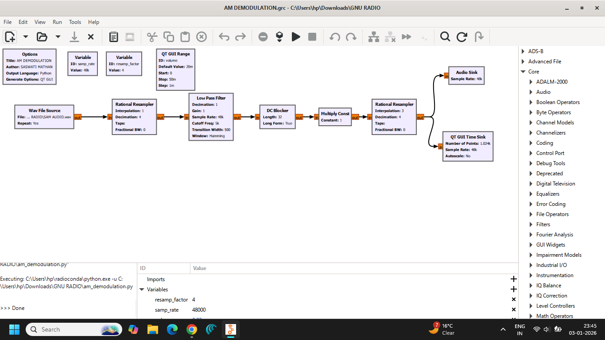
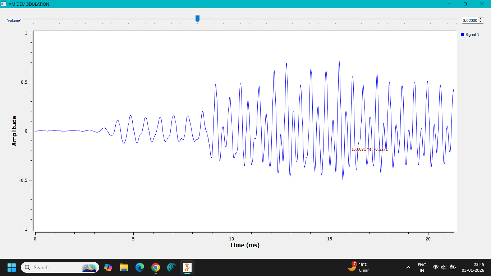
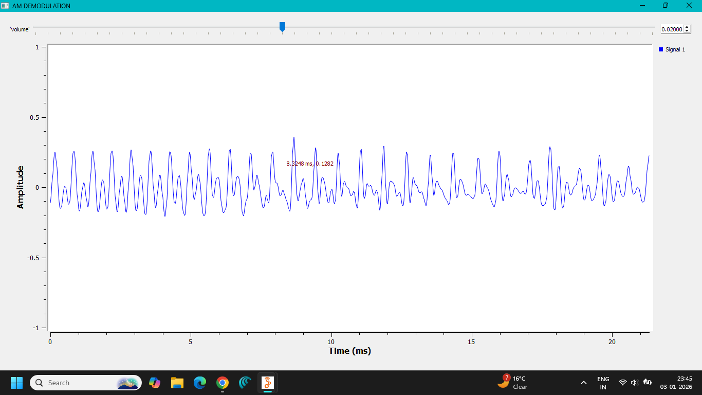
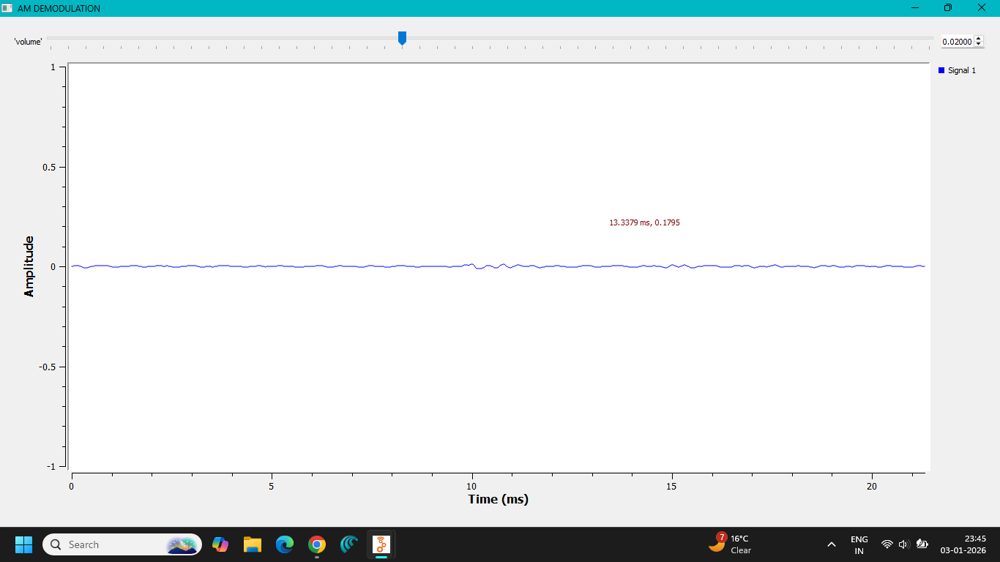

# Lab 02 — AM Demodulation

**Author:** Saswati Anupama Mathan  
**Domain:** Analog Communication  
**Platform:** GNU Radio Companion

---

## 1. Objective

To implement and analyze **Amplitude Modulation (AM) Demodulation** using GNU Radio Companion and recover the original message signal from an AM-modulated waveform.

The experiment demonstrates the basic principle of an **AM receiver**, where the information contained in the amplitude envelope of the received signal is extracted to reconstruct the original message.

---

## 2. Theory

### Amplitude Demodulation

In Amplitude Modulation, the message signal is used to vary the amplitude of a high-frequency carrier.

At the receiver, the original message must be recovered from the modulated signal. This process is called **demodulation** or **detection**.

For conventional AM, the information is contained in the **envelope** of the AM waveform. Therefore, an envelope detector can be used to recover the message.

For a single-tone AM signal:

$$
s(t)=A_c[1+\mu\cos(2\pi f_m t)]\cos(2\pi f_c t)
$$

where:

- $A_c$ = carrier amplitude
- $\mu$ = modulation index
- $f_m$ = message frequency
- $f_c$ = carrier frequency

The envelope of the AM signal is:

$$
A_c[1+\mu\cos(2\pi f_m t)]
$$

By extracting this envelope and removing the DC component, the original message signal can be recovered.

---

## 3. Envelope Detector Principle

An envelope detector generally consists of:

- Rectifier
- Low-pass filter

The rectifier converts the AM waveform into a unidirectional signal, while the low-pass filter removes the high-frequency carrier components.

Conceptually:

$$
\text{AM Signal}
\rightarrow
\text{Rectification}
\rightarrow
\text{Low-Pass Filtering}
\rightarrow
\text{Recovered Message}
$$

The cutoff frequency of the low-pass filter should be:

$$
f_m < f_{LPF} \ll f_c
$$

This allows the message variations to pass while attenuating the carrier-frequency components.

---

## 4. Demodulation Condition

For distortion-free envelope detection, the AM signal should satisfy:

$$
0 \leq \mu \leq 1
$$

When:

$$
\mu > 1
$$

the signal is **over-modulated** and its envelope becomes distorted. An envelope detector may then fail to correctly recover the original message.

---

## 5. GNU Radio Implementation

The AM demodulation system was implemented using GNU Radio Companion.

The flowgraph processes the received AM signal and extracts the information contained in its envelope.

The generated GNU Radio implementation is also included in the `python/` directory.

---

## 6. GNU Radio Flowgraph

The implemented AM demodulation flowgraph is shown below.



---

## 7. Time-Domain Analysis

The time-domain displays show the AM signal and the recovered message signal.

The demodulation process extracts the low-frequency information from the high-frequency AM waveform.







The recovered waveform demonstrates that the original message information can be extracted from the AM signal.

---

## 8. Observations

1. The received signal contains a high-frequency AM carrier.
2. The carrier amplitude varies according to the message signal.
3. The envelope contains the original message information.
4. The demodulation process extracts the low-frequency message component.
5. The recovered waveform follows the shape of the original message.
6. Proper filtering is required to remove unwanted high-frequency components.
7. Over-modulation can cause distortion during envelope detection.

---

## 9. Advantages

- Simple receiver implementation.
- Suitable for conventional AM signals.
- Envelope detection does not require a synchronized carrier.
- Computationally simple.
- Easy to implement and visualize using GNU Radio.

---

## 10. Limitations

- Sensitive to over-modulation.
- Amplitude noise directly affects the recovered signal.
- Envelope detection is not suitable for suppressed-carrier AM techniques such as DSB-SC.
- Proper filter design is required for accurate message recovery.

---

## 11. Applications

AM demodulation techniques are used in:

- AM radio receivers
- Aviation communication
- Analog communication systems
- Educational communication-system experiments
- Signal-processing demonstrations

---

## 12. Files Included

### GNU Radio Flowgraph

```text
flowgraph/
└── AM DEMODULATION.grc

### Generated Python File

```text
python/
└── am_demodulation.py

### Screenshots

```text
screenshots/
├── FLOWGRAPH.png
├── TIME-DOMAIN-1.png
├── TIME-DOMAIN-2.png
└── TIME-DOMAIN-3.png
## 13. Result

**AM Demodulation was successfully implemented using GNU Radio Companion.**

The AM signal was processed to recover the original message waveform. The time-domain observations demonstrated the extraction of the information-bearing signal from the modulated carrier.

---

## 14. Conclusion

This experiment demonstrated the fundamental principle of **AM demodulation**.

The experiment established that the information in a conventional AM signal is contained in its amplitude envelope. By extracting the envelope and filtering the high-frequency components, the original message signal can be recovered.

GNU Radio provided a practical environment for observing and understanding the complete AM demodulation process.

---

**Author:** Saswati Anupama Mathan  
**Experiment:** Lab 02 — AM Demodulation  
**Platform:** GNU Radio Companion
