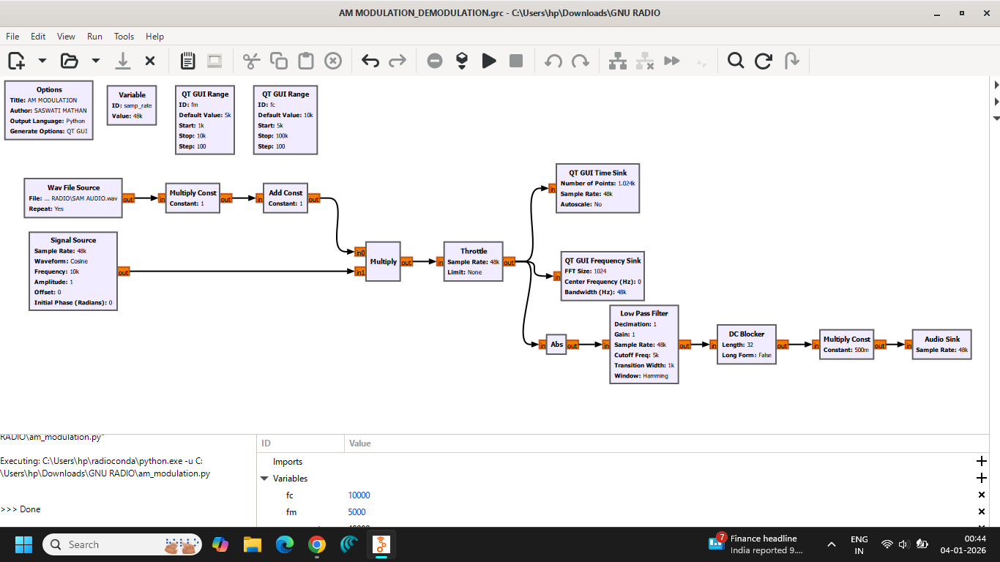
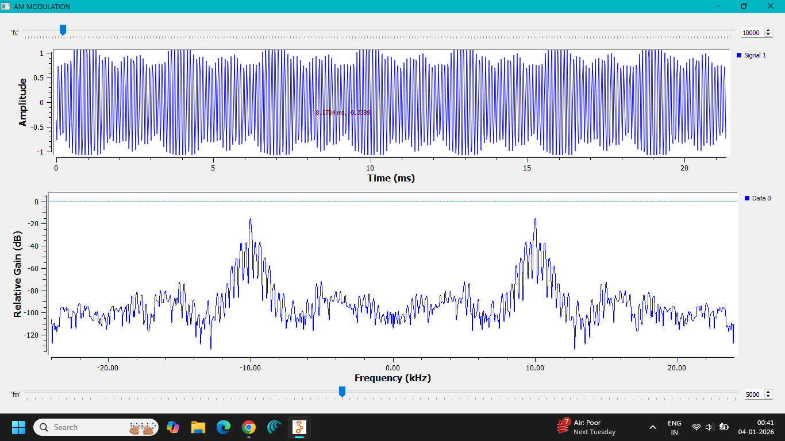
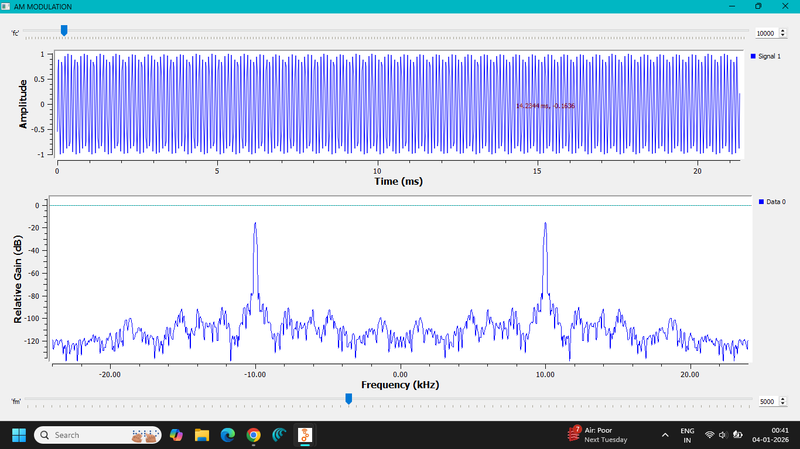
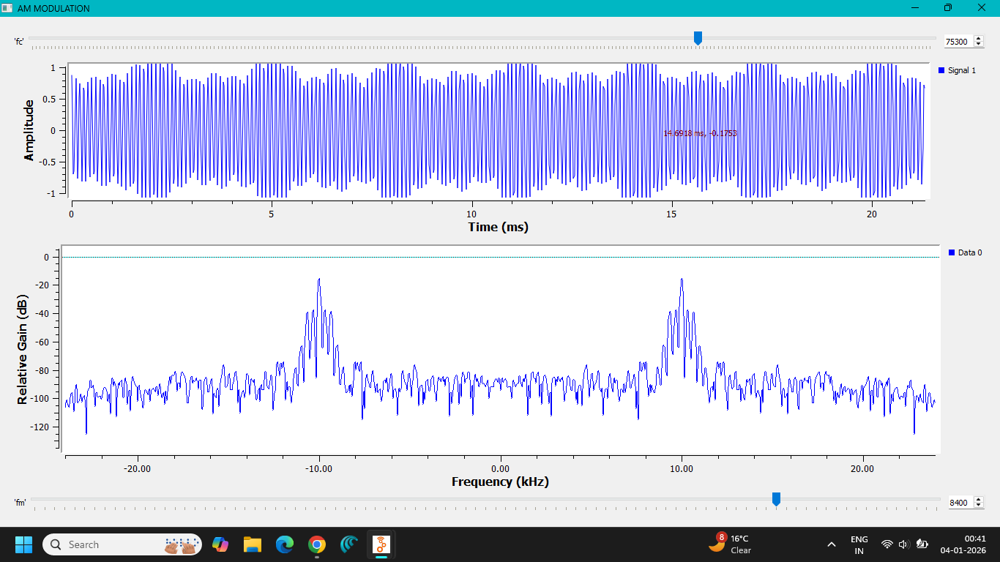
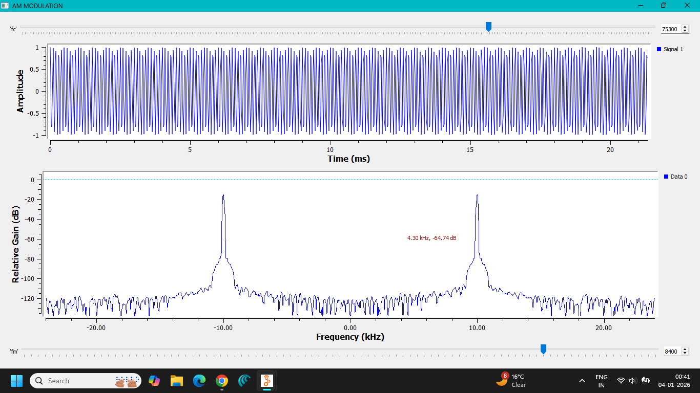

# Lab 03 — AM Modulation and Demodulation

**Author:** Saswati Anupama Mathan  
**Domain:** Analog Communication  
**Platform:** GNU Radio Companion

---

## 1. Objective

To implement a complete **AM modulation and demodulation system** using GNU Radio Companion and observe the transmission and recovery of an information-bearing signal.

The experiment demonstrates the complete communication chain:

$$
\text{Message Signal}
\rightarrow
\text{AM Modulation}
\rightarrow
\text{AM Signal}
\rightarrow
\text{AM Demodulation}
\rightarrow
\text{Recovered Message}
$$

---

## 2. Theory

### AM Modulation

Amplitude Modulation is a technique in which the amplitude of a high-frequency carrier is varied according to the instantaneous amplitude of the message signal.

For a single-tone message:

$$
m(t)=A_m\cos(2\pi f_m t)
$$

the AM signal can be written as:

$$
s(t)=A_c[1+\mu\cos(2\pi f_m t)]\cos(2\pi f_c t)
$$

where:

- $A_c$ = carrier amplitude
- $A_m$ = message amplitude
- $f_c$ = carrier frequency
- $f_m$ = message frequency
- $\mu$ = modulation index

The modulation index is:

$$
\mu=\frac{A_m}{A_c}
$$

For conventional AM without over-modulation:

$$
0\leq\mu\leq1
$$

### AM Demodulation

At the receiver, the original message is recovered from the AM signal. Since the information is contained in the amplitude envelope, an envelope-detection process can be used.

The basic principle is:

$$
\text{AM Signal}
\rightarrow
\text{Envelope Detection}
\rightarrow
\text{Low-Pass Filtering}
\rightarrow
\text{Recovered Message}
$$

The recovered signal should have the same information-bearing waveform as the original message.

---

## 3. Frequency Components and Bandwidth

For a single-tone AM signal, the spectrum contains:

- Lower Sideband (LSB): $f_c-f_m$
- Carrier: $f_c$
- Upper Sideband (USB): $f_c+f_m$

Therefore, the theoretical AM bandwidth is:

$$
\boxed{BW=2f_m}
$$

The sidebands contain the information associated with the message signal.

---

## 4. GNU Radio Implementation

The complete AM communication system was implemented using GNU Radio Companion.

The flowgraph performs both:

1. AM modulation of the message signal.
2. Demodulation of the resulting AM signal.

The output is then observed to verify recovery of the original message.

---

## 5. GNU Radio Flowgraph

The implemented modulation and demodulation flowgraph is shown below.



---

## 6. Output Analysis

The output displays demonstrate the behavior of the AM signal and the recovered message.









The observations show the transformation of the original message into an AM waveform and the subsequent recovery of the information-bearing signal.

---

## 7. Observations

1. The message signal was used as the information-bearing signal.
2. A high-frequency carrier was used for AM modulation.
3. The carrier amplitude varied according to the message signal.
4. The resulting AM waveform contained the message information in its envelope.
5. The AM signal was processed through the demodulation stage.
6. The original message waveform was recovered at the output.
7. The experiment demonstrated the complete modulation and demodulation process.

---

## 8. Applications

AM modulation and demodulation concepts are fundamental to:

- AM broadcasting
- Aviation communication
- Analog communication systems
- Radio communication
- Communication-system laboratories
- Signal-processing education and simulation

---

## 9. Files Included

### GNU Radio Flowgraph

```text
flowgraph/
└── AM MODULATION_DEMODULATION.grc
```

### Generated Python File

```text
python/
└── am_simulation.py
```

### Screenshots

```text
screenshots/
├── FLOWGRAPH.png
├── OUTPUT-1.png
├── OUTPUT-2.png
├── OUTPUT-3.png
└── OUTPUT-4.png
```

## 10. Result

**AM modulation and demodulation were successfully implemented using GNU Radio Companion.**

The message signal was modulated onto a high-frequency carrier and subsequently demodulated to recover the original information-bearing waveform.

---

## 11. Conclusion

This experiment demonstrated the complete operation of an **AM communication system**, from modulation of the message signal to recovery at the receiver.

The experiment verified that amplitude modulation transfers the message information to a high-frequency carrier, while demodulation extracts the original information from the received AM signal.

GNU Radio provided a practical environment for implementing and visually analyzing the complete communication process.
