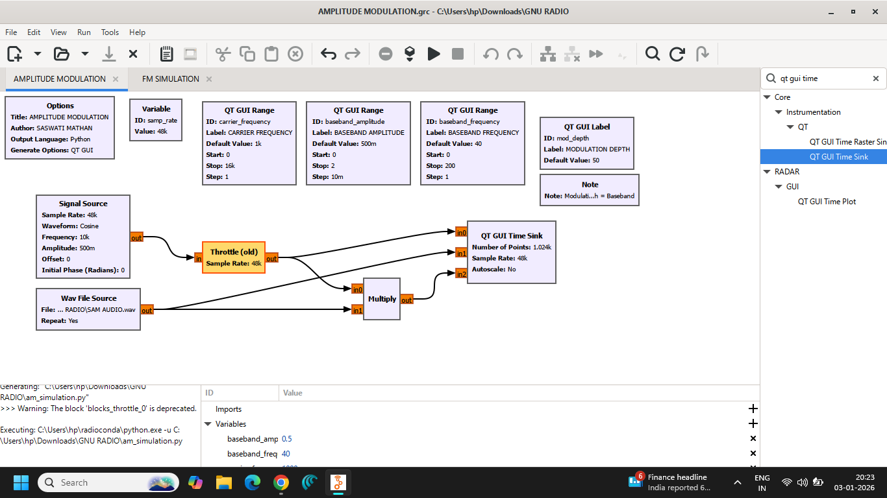
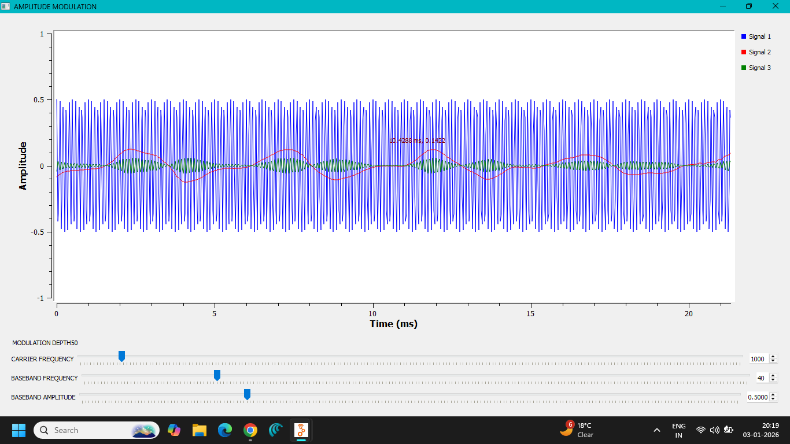
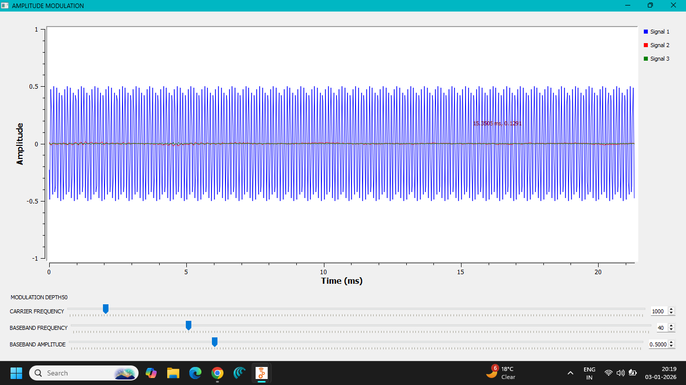
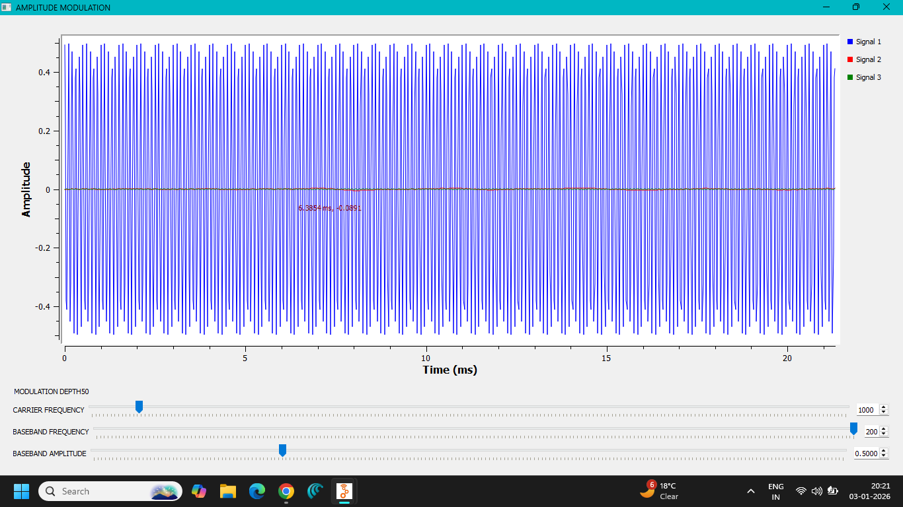
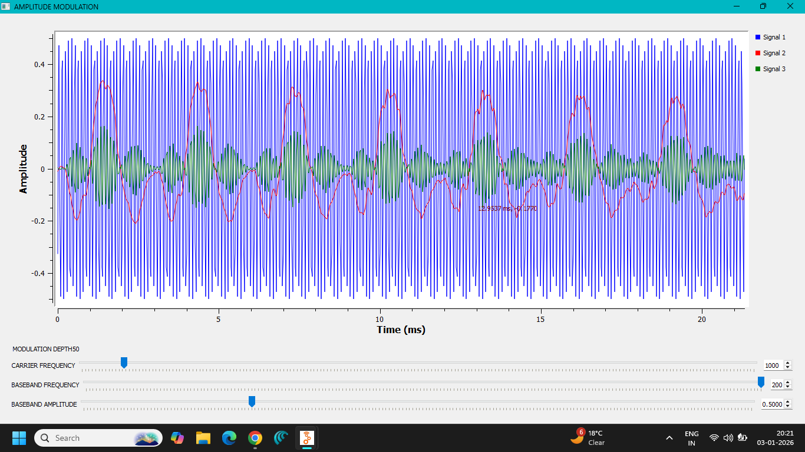
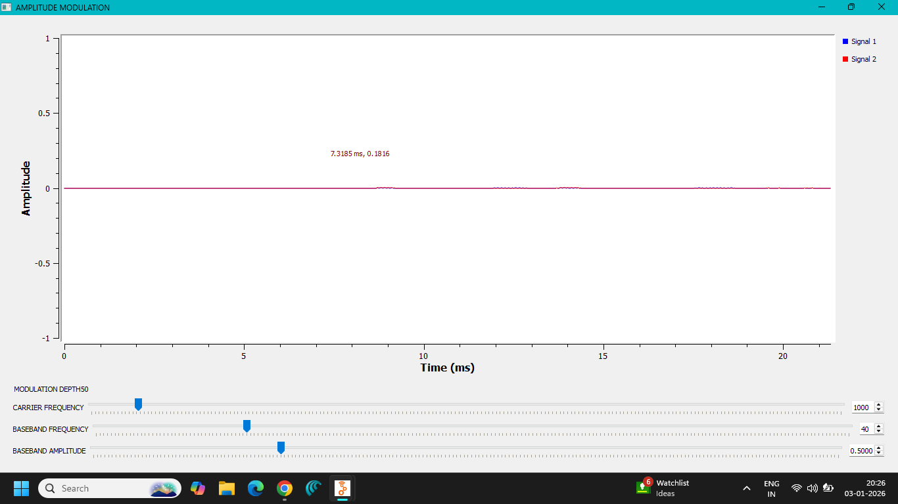
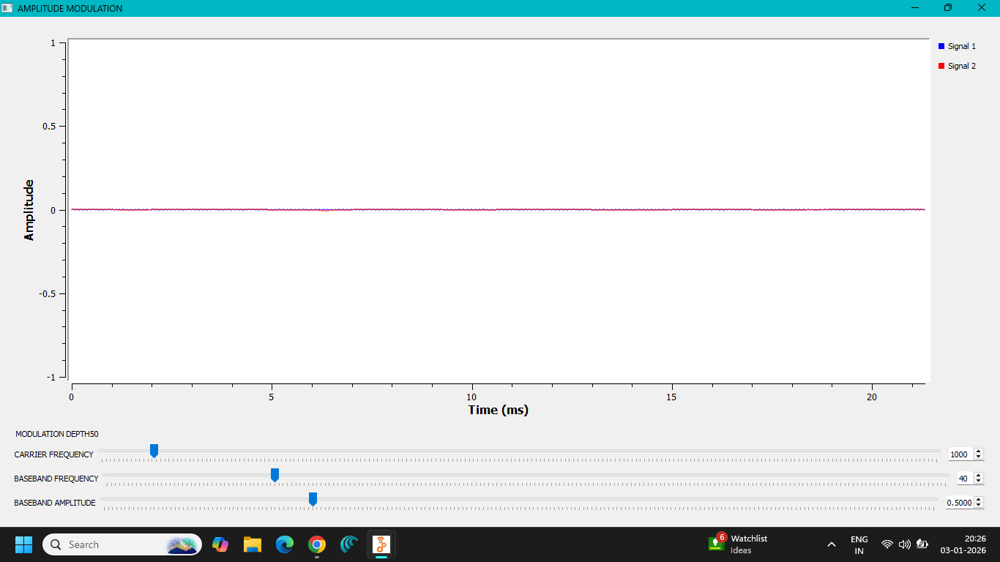

# Lab 04 — DSB-SC Amplitude Modulation

**Author:** Saswati Anupama Mathan  
**Domain:** Analog Communication  
**Platform:** GNU Radio Companion

---

## 1. Objective

To implement **Double Sideband Suppressed Carrier (DSB-SC) Amplitude Modulation** using GNU Radio Companion and analyze the resulting modulated signal in the time and frequency domains.

The experiment demonstrates how the message signal is shifted to a higher-frequency band while the carrier itself is suppressed.

---

## 2. Theory

### DSB-SC Modulation

Double Sideband Suppressed Carrier (DSB-SC) is an amplitude modulation technique in which the carrier is **suppressed**, while both the **Upper Sideband (USB)** and **Lower Sideband (LSB)** are transmitted.

For a message signal:

$$
m(t)
$$

and a carrier:

$$
c(t)=A_c\cos(2\pi f_c t)
$$

the DSB-SC signal is:

$$
s(t)=A_c\,m(t)\cos(2\pi f_c t)
$$

Unlike conventional AM, there is no separate carrier component in the transmitted spectrum.

---

## 3. Principle of Operation

The DSB-SC signal is generated by multiplying the message signal with a high-frequency carrier.

```text
Message Signal
      │
      ▼
   Multiplier ◄──── Carrier Signal
      │
      ▼
    DSB-SC
     Signal

The multiplication operation shifts the spectrum of the message signal to frequencies around the carrier frequency.

For a single-tone message:

$$
m(t)=A_m\cos(2\pi f_m t)
$$

the DSB-SC signal becomes:

$$
s(t)=A_cA_m\cos(2\pi f_m t)\cos(2\pi f_c t)
$$

Using the identity:

$$
\cos A\cos B=
\frac{1}{2}[\cos(A+B)+\cos(A-B)]
$$

we obtain:

$$
s(t)=\frac{A_cA_m}{2}
\left[
\cos 2\pi(f_c+f_m)t+
\cos 2\pi(f_c-f_m)t
\right]
$$

Therefore, the spectrum contains two sidebands:

- **Upper Sideband (USB):** $f_c+f_m$
- **Lower Sideband (LSB):** $f_c-f_m$

The carrier frequency $f_c$ itself is suppressed.

---

## 4. DSB-SC Spectrum

For a single-tone message, the frequency components are:

$$
f_{LSB}=f_c-f_m
$$

$$
f_{USB}=f_c+f_m
$$

There is **no carrier component** at $f_c$.

Therefore, the theoretical bandwidth is:

$$
\boxed{BW=2f_m}
$$

Although DSB-SC occupies the same bandwidth as conventional AM, it provides better power efficiency because carrier power is not transmitted.

---

## 5. DSB-SC vs Conventional AM

| Feature | Conventional AM | DSB-SC |
|---|---|---|
| Carrier transmitted | Yes | No |
| Sidebands | USB + LSB | USB + LSB |
| Bandwidth | $2f_m$ | $2f_m$ |
| Carrier power | Significant | Suppressed |
| Power efficiency | Lower | Higher |
| Demodulation | Simple envelope detector | Coherent detection required |

Since the carrier is suppressed, a conventional envelope detector cannot directly demodulate a DSB-SC signal. **Coherent or synchronous detection** is generally required.

---

## 6. Advantages

- Suppresses the carrier power.
- Provides better power efficiency than conventional AM.
- Both sidebands contain the message information.
- Useful as a fundamental building block for more advanced modulation techniques.
- Demonstrates frequency translation using multiplication.

---

## 7. Disadvantages

- Requires coherent detection at the receiver.
- Carrier synchronization is required for demodulation.
- More complex than conventional AM.
- Both sidebands are still transmitted, so the bandwidth is not reduced.

---

## 8. Applications

DSB-SC concepts are important in:

- Analog communication systems
- Synchronous AM receivers
- Intermediate stages of communication transmitters
- Signal-processing systems
- Generation of SSB signals
- Communication-system laboratory experiments

---

## 9. GNU Radio Implementation

The DSB-SC modulation system was implemented using GNU Radio Companion.

The message signal and carrier signal were applied to a multiplication stage to generate the DSB-SC waveform.

The resulting signal was analyzed using GNU Radio display blocks to observe its behavior.

---

## 10. GNU Radio Flowgraph

The implemented DSB-SC flowgraph is shown below.



---

## 11. Output Analysis

The following screenshots document the observed DSB-SC signal and its characteristics.













The observations demonstrate the generated DSB-SC waveform and its corresponding signal characteristics.

---

## 12. Observations

1. A message signal was generated as the information-bearing signal.
2. A high-frequency carrier was used for frequency translation.
3. The message and carrier were multiplied to generate the DSB-SC signal.
4. The carrier component itself was suppressed.
5. Both the Upper Sideband and Lower Sideband were present.
6. The spectral components appeared around the carrier frequency.
7. The theoretical bandwidth of the DSB-SC signal is twice the highest message frequency.

---

## 13. Files Included

### GNU Radio Flowgraph

```text
flowgraph/
└── DSB-SC AMPLITUDE MODULATION.grc

### Generated Python File

```text
python/
└── dsb-sc_am.py

### Screenshots

```text
screenshots/
├── FLOWGRAPH.png
├── OUTPUT-1.png
├── OUTPUT-2.png
├── OUTPUT-3.png
├── OUTPUT-4.png
├── OUTPUT-5.png
└── OUTPUT-6.png

## 14. Result

**DSB-SC amplitude modulation was successfully implemented using GNU Radio Companion.**

The message signal was multiplied with a carrier to generate a double-sideband suppressed-carrier signal. The resulting waveform demonstrated the presence of the upper and lower sidebands while the carrier component was suppressed.

---

## 15. Conclusion

This experiment demonstrated the fundamental principle of **Double Sideband Suppressed Carrier (DSB-SC) modulation**.

Unlike conventional AM, DSB-SC does not transmit the carrier, resulting in improved power efficiency. However, coherent detection is required for proper demodulation because the carrier is not available at the receiver.

GNU Radio provided a practical environment for implementing and analyzing the DSB-SC modulation process in both time and frequency domains.
