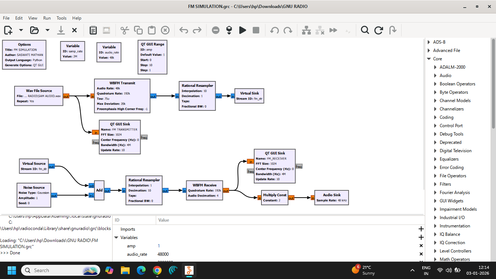
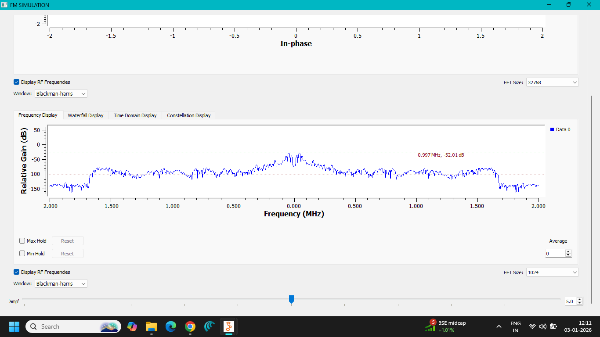
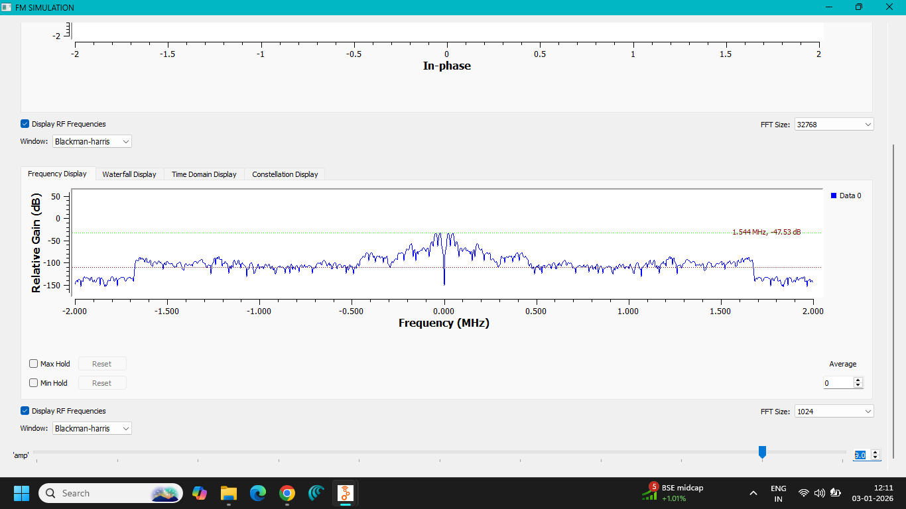
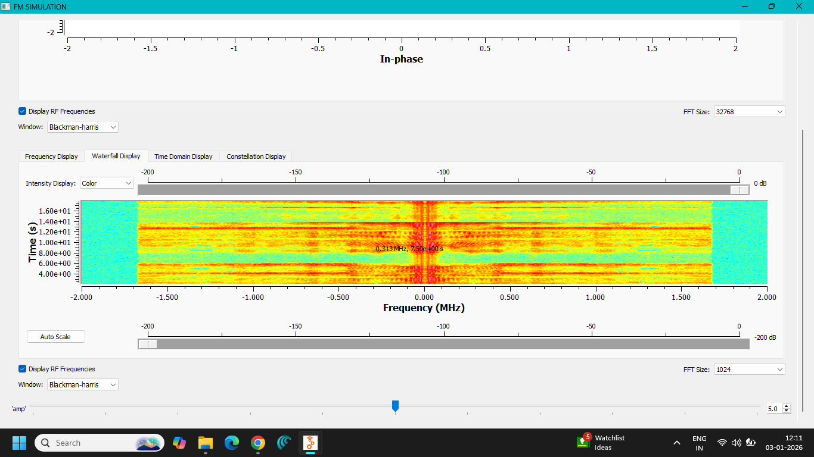
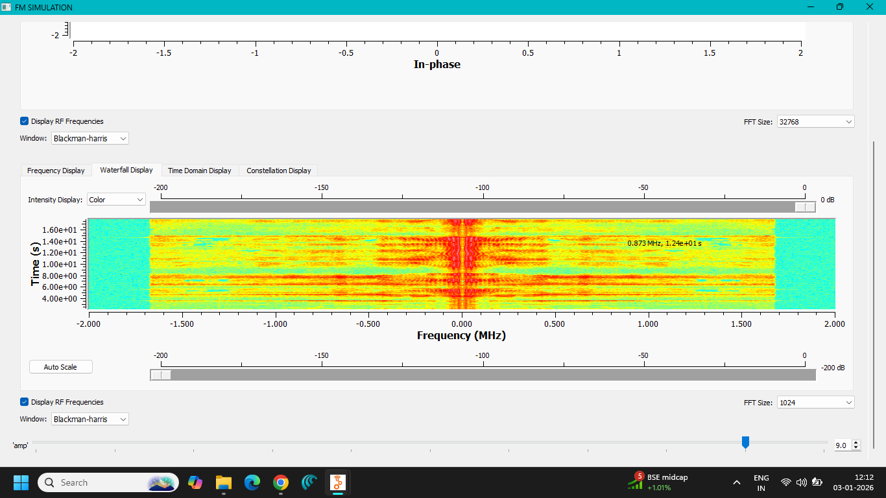
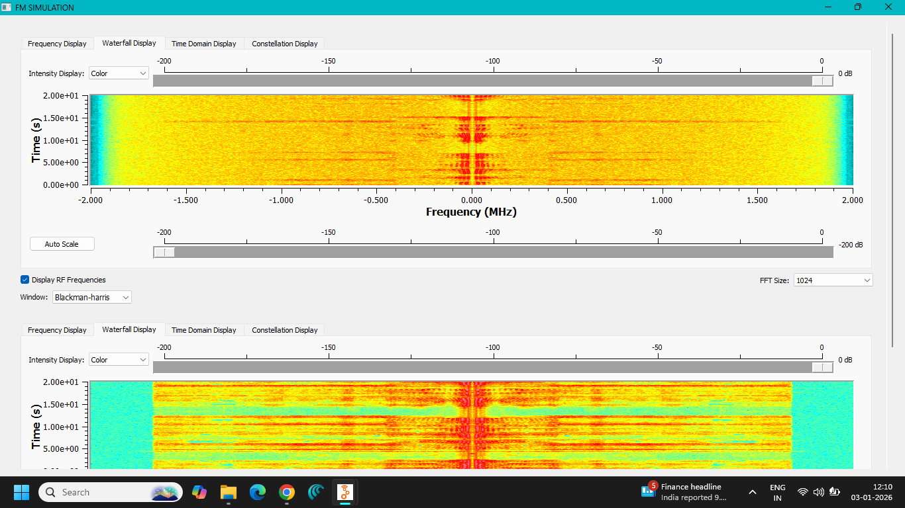

# Lab 05 — FM Simulation

**Author:** Saswati Anupama Mathan  
**Domain:** Analog Communication  
**Platform:** GNU Radio Companion

---

## 1. Objective

To implement and analyze **Frequency Modulation (FM)** using GNU Radio Companion and observe the behavior of the FM signal in the time and frequency domains.

The experiment demonstrates how the instantaneous frequency of a carrier is varied according to the amplitude of the message signal.

---

## 2. Theory

### Frequency Modulation

Frequency Modulation is an analog modulation technique in which the **instantaneous frequency of a high-frequency carrier is varied according to the instantaneous amplitude of the message signal**.

In FM:

- Carrier amplitude remains approximately constant.
- Carrier frequency varies according to the message signal.
- Carrier phase changes as a consequence of the frequency variation.

For a message signal:

$$
m(t)
$$

and carrier frequency $f_c$, the FM signal can be represented as:

$$
s(t)=A_c\cos
\left[
2\pi f_c t+
2\pi k_f\int m(t)\,dt
\right]
$$

where:

- $A_c$ = carrier amplitude
- $f_c$ = carrier frequency
- $k_f$ = frequency sensitivity
- $m(t)$ = message signal

---

## 3. Single-Tone FM

For a sinusoidal message:

$$
m(t)=A_m\cos(2\pi f_m t)
$$

the FM signal becomes:

$$
s(t)=A_c\cos
\left[
2\pi f_c t+
\beta\sin(2\pi f_m t)
\right]
$$

where $\beta$ is the **FM modulation index**.

The modulation index is:

$$
\boxed{\beta=\frac{\Delta f}{f_m}}
$$

where:

- $\Delta f$ = peak frequency deviation
- $f_m$ = message frequency

Therefore:

$$
\boxed{\Delta f=\beta f_m}
$$

---

## 4. Frequency Deviation

Frequency deviation represents the maximum change in the instantaneous carrier frequency from its unmodulated value.

The instantaneous frequency can be expressed as:

$$
f_i(t)=f_c+k_fm(t)
$$

For a sinusoidal message, the instantaneous frequency varies between:

$$
f_c-\Delta f
$$

and

$$
f_c+\Delta f
$$

Thus, the total frequency excursion is:

$$
2\Delta f
$$

---

## 5. FM Spectrum

Unlike AM, an FM signal theoretically contains an **infinite number of sidebands** around the carrier.

The significant spectral components occur approximately at:

$$
f_c\pm nf_m
$$

where:

$$
n=1,2,3,\ldots
$$

The amplitudes of the sidebands depend on the modulation index and are described mathematically using Bessel functions.

In practical communication systems, only the significant sidebands are considered when determining the required bandwidth.

---

## 6. FM Bandwidth — Carson's Rule

A commonly used approximation for the bandwidth of an FM signal is **Carson's Rule**:

$$
\boxed{BW\approx2(\Delta f+f_m)}
$$

Using:

$$
\beta=\frac{\Delta f}{f_m}
$$

the bandwidth can also be written as:

$$
BW\approx2f_m(\beta+1)
$$

Carson's Rule provides a practical estimate of the bandwidth containing most of the FM signal power.

---

## 7. FM vs AM

| Feature | AM | FM |
|---|---|---|
| Parameter varied | Amplitude | Frequency |
| Carrier amplitude | Varies | Approximately constant |
| Carrier frequency | Constant | Varies instantaneously |
| Noise immunity | Lower | Higher |
| Bandwidth | $2f_m$ | Approximately $2(\Delta f+f_m)$ |
| Power efficiency | Lower | Better under suitable conditions |
| Demodulation | Envelope detection possible | Frequency/phase discriminator methods |

---

## 8. Advantages of FM

- Better immunity to amplitude noise.
- Constant-amplitude transmission allows efficient power amplification.
- Provides improved audio quality compared with conventional AM broadcasting.
- Suitable for high-fidelity analog communication.
- Less affected by amplitude variations introduced by the communication channel.

---

## 9. Disadvantages of FM

- Requires greater bandwidth than conventional AM.
- FM transmitter and receiver circuits can be more complex.
- Frequency modulation can require accurate frequency control.
- Wideband FM systems occupy significant spectrum.

---

## 10. Applications

FM is widely associated with:

- FM radio broadcasting
- Two-way radio communication
- Mobile communication systems
- VHF communication
- Television sound transmission
- Analog telemetry
- Communication-system laboratory experiments

---

## 11. GNU Radio Implementation

The FM system was implemented using GNU Radio Companion.

The message signal was applied to an FM modulation stage, which varied the instantaneous frequency of the carrier according to the message amplitude.

Various GNU Radio display blocks were used to observe:

- Time-domain waveform
- Frequency-domain spectrum
- Relative gain
- In-phase and quadrature components
- Waterfall display

---

## 12. GNU Radio Flowgraph

The implemented FM simulation flowgraph is shown below.



---

## 13. Time-Domain Analysis

The time-domain displays demonstrate the behavior of the FM waveform.


In an FM waveform, the amplitude remains approximately constant while the spacing between successive cycles changes according to the instantaneous frequency.

---

## 14. Frequency-Domain Analysis

The frequency-domain displays demonstrate the spectral characteristics of the FM signal.






The spectrum contains the carrier and multiple sidebands located at frequency offsets related to the message frequency.

---

## 15. Relative Gain Analysis

The relative-gain displays provide additional information about the spectral response of the FM signal.


These observations help visualize the relative strength of the spectral components produced by frequency modulation.

---

## 16. Quadrature and In-Phase Analysis

The FM simulation also includes observations of the in-phase and quadrature components.


The I/Q representation provides another way of visualizing the signal behavior in a two-dimensional signal space.

---

## 17. Waterfall Analysis

The waterfall display provides a time-varying representation of the signal spectrum.







The waterfall display helps visualize how the frequency components of the FM signal evolve over time.

---

## 18. Observations

1. The message signal was used as the information-bearing signal.
2. The carrier frequency varied according to the instantaneous amplitude of the message.
3. The amplitude of the FM waveform remained approximately constant.
4. The spacing between waveform cycles changed with instantaneous frequency.
5. Multiple sidebands appeared around the carrier frequency.
6. The frequency-domain display demonstrated the characteristic FM spectrum.
7. The I/Q displays provided additional visualization of the modulated signal.
8. The waterfall displays demonstrated the time-varying spectral behavior of the FM signal.
9. The practical bandwidth of FM can be estimated using Carson's Rule.

---

## 19. Files Included

### GNU Radio Flowgraph

```text
flowgraph/
└── FM SIMULATION.grc

### Generated Python File

The generated Python directory is retained as part of the experiment structure.

```text
python/

The GNU Radio flowgraph can generate a Python implementation when executed or exported.

---

### Screenshots

The experiment contains the following documented observations:

```text
screenshots/

├── FLOWGRAPH.png
├── FREQUENCY DOMAIN.png
├── FREQUENCY DOMAIN_RELATIVE GAIN.png
├── FREQUENCY_DISPLAY-1.png
├── FREQUENCY_DISPLAY-2.png
├── QUADRATURE_IN PHASE_PLOT-1.png
├── QUADRATURE_IN PHASE_PLOT-2.png
├── RELATIVE GAIN-2.png
├── RELATIVE GAIN-3.png
├── TIME DOMAIN-2.png
├── TIME DOMAIN-3.png
├── TIME DOMAIN-4.png
├── TIME DOMAIN-5.png
├── WATERFALL_DISPLAY-1.png
├── WATERFALL_DISPLAY-2.png
└── WATERFALL_DISPLAY-3.png

---

## 20. Result

**Frequency Modulation was successfully implemented and analyzed using GNU Radio Companion.**

The experiment demonstrated the variation of the carrier's instantaneous frequency according to the message signal while maintaining approximately constant carrier amplitude.

The time-domain, frequency-domain, I/Q, relative-gain, and waterfall displays provided different views of the FM signal and its characteristics.

---

## 21. Conclusion

This experiment demonstrated the fundamental principle of **Frequency Modulation (FM)**.

Unlike AM, FM conveys information by varying the instantaneous frequency of the carrier according to the message signal, while the carrier amplitude remains approximately constant.

The experiment also demonstrated the characteristic FM spectrum containing multiple sidebands and showed how different GNU Radio visualization tools can be used to analyze the signal in both the time and frequency domains.

GNU Radio provided a practical environment for connecting the mathematical theory of FM with an actual signal-processing implementation.
