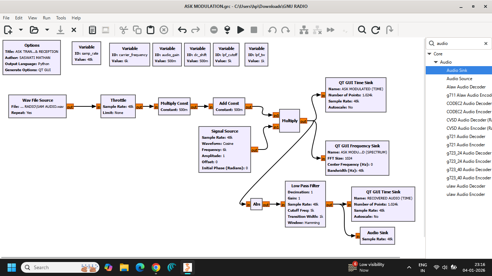
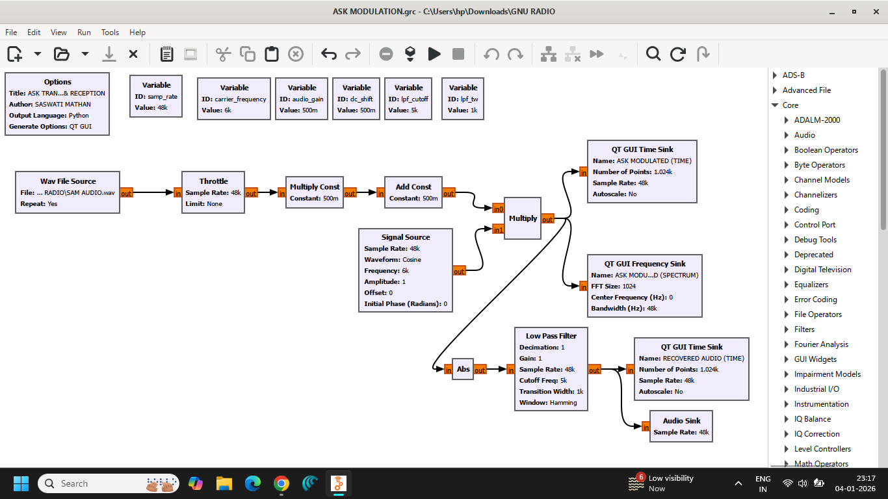
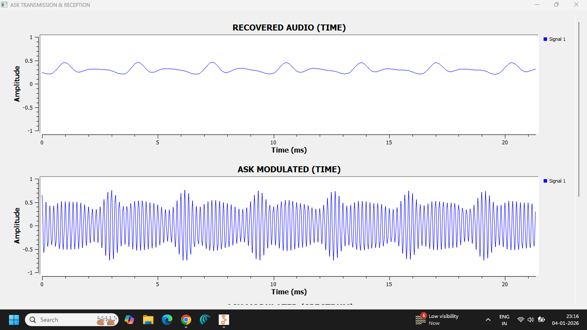
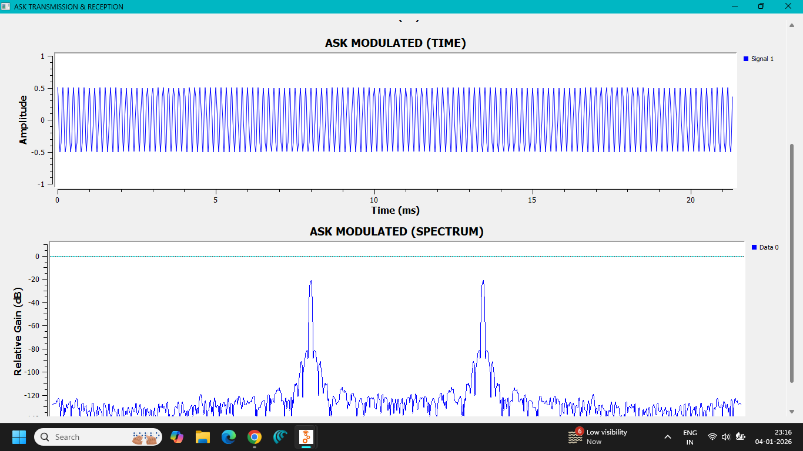
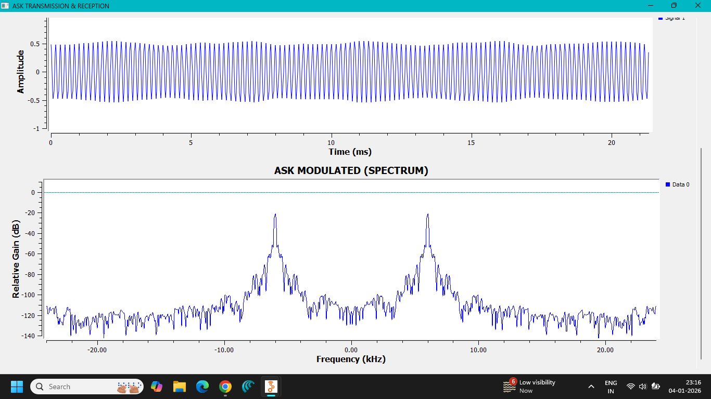

# Lab 06 — Amplitude Shift Keying (ASK) Modulation

**Author:** Saswati Anupama Mathan  
**Experiment:** Lab 06 — ASK Modulation  
**Platform:** GNU Radio Companion

---

## 1. Objective

To implement and analyze **Amplitude Shift Keying (ASK)** using GNU Radio Companion and observe the resulting modulated signal in the time and frequency domains.

---

## 2. Theory

**Amplitude Shift Keying (ASK)** is a digital modulation technique in which the **amplitude of a carrier signal is varied according to the digital input data**, while the carrier frequency and phase remain constant.

For binary ASK, two amplitude levels are used to represent the two binary symbols.

A simple form of binary ASK can be represented as:

$$
s(t) = A_c m(t)\cos(2\pi f_c t)
$$

where:

- $A_c$ = carrier amplitude
- $f_c$ = carrier frequency
- $m(t)$ = binary message signal

For the simplest form of ASK, often called **On-Off Keying (OOK)**:

- Binary `1` → carrier is transmitted
- Binary `0` → carrier is absent

Thus, the digital data controls whether the carrier appears with a particular amplitude.

---

## 3. Principle of Operation

The basic ASK process can be represented as:

**Binary Data → Amplitude Modulation → ASK Signal**

When the input bit is `1`, the carrier is transmitted with the selected amplitude.

When the input bit is `0`, the carrier amplitude is reduced to zero in the OOK form of ASK.

Therefore, the information is represented by changes in the **carrier amplitude**.

---

## 4. ASK Signal

For binary ASK:

$$
s(t)=
\begin{cases}
A_c\cos(2\pi f_c t), & \text{for binary 1}\\
0, & \text{for binary 0}
\end{cases}
$$

The carrier frequency remains unchanged. Only its amplitude is controlled by the digital data.

---

## 5. Frequency-Domain Characteristics

ASK produces a spectrum centered around the carrier frequency.

The exact bandwidth depends on the characteristics and bit rate of the digital data.

Because abrupt changes in amplitude introduce additional frequency components, the ASK spectrum contains components around the carrier rather than only a single carrier frequency.

---

## 6. ASK vs Analog AM

| Feature | Analog AM | ASK |
|---|---|---|
| Input | Analog message | Digital data |
| Parameter varied | Carrier amplitude | Carrier amplitude |
| Information representation | Continuous amplitude variation | Discrete amplitude levels |
| Carrier frequency | Constant | Constant |
| Typical application | Analog broadcasting | Digital communication |

ASK can therefore be viewed as a digital counterpart of amplitude-based modulation.

---

## 7. Advantages

- Simple modulation principle.
- Simple transmitter implementation.
- Easy to generate using digital logic and signal-processing systems.
- Suitable for low-complexity digital communication systems.
- Easy to visualize and analyze using GNU Radio.

---

## 8. Disadvantages

- Sensitive to amplitude noise.
- Performance can degrade significantly in noisy channels.
- Less robust than some other digital modulation techniques such as FSK and PSK.
- Changes in received signal amplitude can affect reliable symbol detection.

---

## 9. Applications

ASK and its variants are used in applications such as:

- Digital communication systems
- Optical communication systems
- RFID systems
- Low-cost wireless communication
- Remote-control systems
- Educational communication-system experiments

---

## 10. GNU Radio Implementation

The ASK modulation system was implemented using **GNU Radio Companion**.

A digital data source was used to generate the binary information signal. The digital data controlled the amplitude of a carrier signal to produce the ASK waveform.

The resulting signal was observed using GNU Radio visualization blocks.

---

## 11. GNU Radio Flowgraph

The implemented ASK modulation flowgraph is shown below.





---

## 12. Output Analysis

The following screenshots document the observed ASK signal.







The output demonstrates the variation of the carrier amplitude according to the transmitted binary data.

---

## 13. Observations

1. A digital binary signal was used as the information source.
2. A carrier signal was used for modulation.
3. The amplitude of the carrier was controlled by the binary input.
4. Different amplitude states represented different digital symbols.
5. The carrier frequency remained constant.
6. The ASK waveform exhibited amplitude transitions corresponding to changes in the input data.
7. The resulting signal contained frequency components around the carrier frequency.

---

## 14. Files Included

### GNU Radio Flowgraph

```text
flowgraph/

└── ASK MODULATION.grc

### Generated Python File

```text
python/└── ask_tx_rx.py

### Screenshots

```text
screenshots/
├── FLOWGRAPH-1.png
├── FLOWGRAPH-2.png
├── OUTPUT-1.png
├── OUTPUT-2.png
└── OUTPUT-3.png

---

## 15. Result

**Amplitude Shift Keying (ASK) was successfully implemented using GNU Radio Companion.**

The binary input data controlled the amplitude of the carrier, producing an ASK-modulated waveform. The resulting signal demonstrated the fundamental principle of representing digital information through discrete carrier-amplitude variations.

---

## 16. Conclusion

This experiment demonstrated the fundamental principle of **Amplitude Shift Keying (ASK)**.

ASK represents digital information by changing the amplitude of a carrier according to the input data while maintaining a constant carrier frequency.

GNU Radio provided a practical environment for implementing and visualizing the ASK modulation process and helped establish the relationship between digital data and the resulting modulated waveform.
