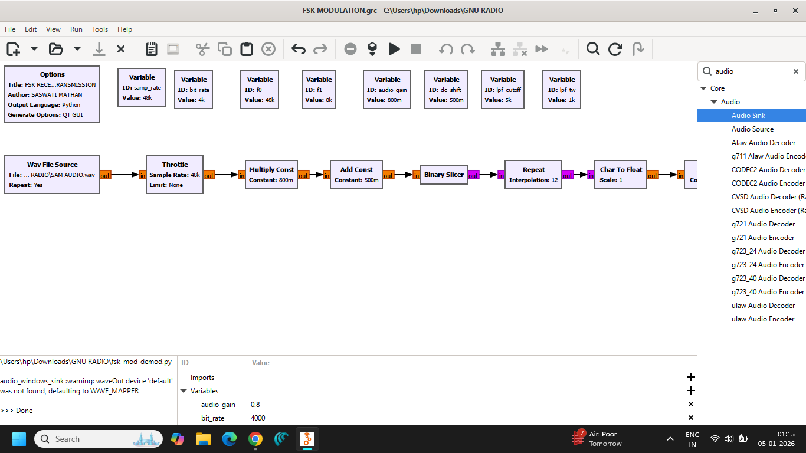
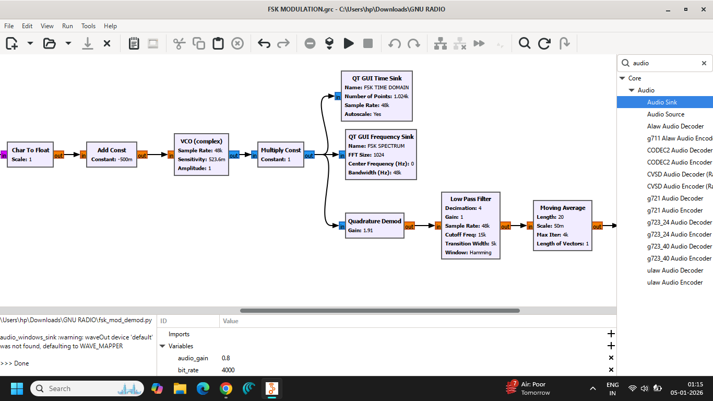
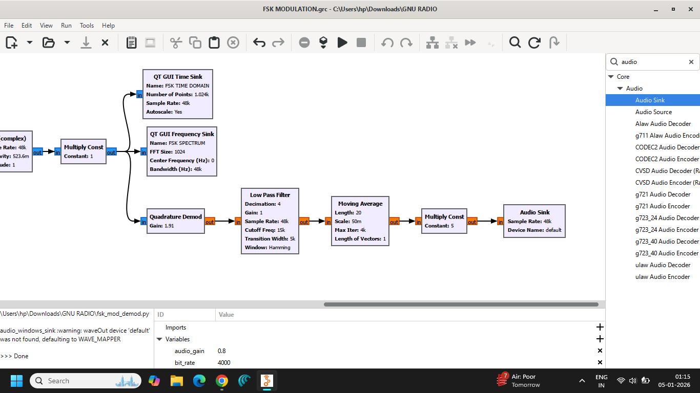

# Lab 07 — Frequency Shift Keying (FSK) Modulation

**Author:** Saswati Anupama Mathan  
**Experiment:** Lab 07 — FSK Modulation  
**Platform:** GNU Radio Companion

---

## 1. Objective

To implement and analyze **Frequency Shift Keying (FSK)** using GNU Radio Companion and observe how digital information is represented by changes in the carrier frequency.

---

## 2. Theory

**Frequency Shift Keying (FSK)** is a digital modulation technique in which the **frequency of the carrier is varied according to the digital input data**, while the carrier amplitude remains approximately constant.

In binary FSK (BFSK), two different carrier frequencies are used to represent the two binary symbols.

Typically:

- Binary `1` → frequency $f_1$
- Binary `0` → frequency $f_0$

The amplitude remains constant, while the frequency changes according to the transmitted bit.

---

## 3. Principle of Operation

The basic FSK process can be represented as:

**Binary Data → Frequency Selection → FSK Signal**

For binary FSK:

$$
s(t)=
\begin{cases}
A_c\cos(2\pi f_1t), & \text{for binary 1}\\
A_c\cos(2\pi f_0t), & \text{for binary 0}
\end{cases}
$$

where:

- $A_c$ = carrier amplitude
- $f_1$ = frequency representing binary `1`
- $f_0$ = frequency representing binary `0`

Thus, the information is represented by switching between two carrier frequencies.

---

## 4. FSK Signal Characteristics

Unlike ASK, where the carrier amplitude changes, FSK keeps the amplitude approximately constant and changes the carrier frequency.

For example:

```text
Binary data:    1    0    1    1    0

Carrier:       f1   f0   f1   f1   f0
```

Therefore, the receiver determines the transmitted data by identifying which frequency is present during each symbol interval.

---

## 5. FSK Spectrum

An FSK signal contains frequency components around the selected carrier frequencies.

For binary FSK, the two principal frequencies are:

$$
f_0
$$

and

$$
f_1
$$

The separation between these frequencies affects the bandwidth and the ability of the receiver to distinguish between the two symbols.

The required bandwidth depends on the frequency separation, bit rate, and filtering characteristics of the system.

---

## 6. FSK vs ASK

| Feature | ASK | FSK |
|---|---|---|
| Parameter varied | Amplitude | Frequency |
| Carrier amplitude | Changes | Approximately constant |
| Carrier frequency | Constant | Changes |
| Noise performance | More sensitive to amplitude noise | Generally more robust to amplitude variations |
| Symbol representation | Amplitude levels | Frequency levels |

---

## 7. Advantages

- More resistant to amplitude noise than ASK.
- Carrier amplitude can remain approximately constant.
- Suitable for digital communication systems.
- Relatively simple concept and implementation.
- Easy to visualize using GNU Radio.

---

## 8. Disadvantages

- Generally requires more bandwidth than ASK or PSK for comparable data rates.
- Frequency generation and detection can be more complex.
- Frequency separation must be sufficient for reliable detection.
- Spectral efficiency can be lower than some other digital modulation techniques.

---

## 9. Applications

FSK and its variants are used in applications such as:

- Digital communication systems
- Modems
- Radio communication
- Telemetry systems
- Low-rate wireless communication
- Caller ID systems
- Educational communication-system experiments

---

## 10. GNU Radio Implementation

The FSK modulation system was implemented using **GNU Radio Companion**.

A digital data source was used to generate the binary information signal. The binary data controlled the frequency of the carrier, producing the FSK-modulated waveform.

The resulting signal was analyzed using time-domain and frequency-domain visualization blocks.

---

## 11. GNU Radio Flowgraph

The implemented FSK modulation flowgraph is shown below.







---

## 12. Output Analysis

The following screenshots document the observed FSK signal.


The observations demonstrate the change in carrier frequency according to the transmitted binary data.

---

## 13. Observations

1. A digital binary signal was used as the information source.
2. Two different carrier frequencies were used to represent the binary symbols.
3. The carrier frequency changed according to the input data.
4. The carrier amplitude remained approximately constant.
5. Different frequency states represented binary `0` and binary `1`.
6. The time-domain waveform demonstrated changes in the instantaneous frequency.
7. The frequency-domain representation showed the principal frequency components associated with the FSK signal.

---

## 14. Files Included

### GNU Radio Flowgraph

```text
flowgraph/
└── FSK MODULATION.grc
```

### Generated Python File

```text
python/
└── fsk_mod_demod.py
```

### Screenshots

```text
screenshots/
├── FLOWGRAPH-1.png
├── FLOWGRAPH-2.png
├── FLOWGRAPH-3.png
├── FREQUENCY DOMAIN.png
└── TIME DOMAIN.png
```

## 15. Result

**Frequency Shift Keying (FSK) was successfully implemented using GNU Radio Companion.**

The binary input data controlled the frequency of the carrier, producing an FSK-modulated waveform. The resulting signal demonstrated the fundamental principle of representing digital information through discrete carrier-frequency variations.

---

## 16. Conclusion

This experiment demonstrated the fundamental principle of **Frequency Shift Keying (FSK)**.

FSK represents digital information by changing the carrier frequency according to the input data while maintaining approximately constant carrier amplitude.

GNU Radio provided a practical environment for implementing and visualizing the FSK modulation process and helped establish the relationship between digital data and the resulting frequency-shifted carrier signal.

