# Lab 08 — QPSK Modulation and Demodulation

## 1. Objective

To implement and analyze **Quadrature Phase Shift Keying (QPSK)** modulation and demodulation using **GNU Radio Companion**, and to observe the transmitted and recovered signals in the presence of AWGN.

---

## 2. Theory

**Quadrature Phase Shift Keying (QPSK)** is a digital phase modulation technique in which the phase of the carrier is varied according to the input digital data.

Unlike BPSK, which represents one bit per symbol using two phase states, QPSK uses **four distinct phase states**. Therefore, each QPSK symbol represents:

\[
\log_2(4)=2 \text{ bits}
\]

Thus, QPSK transmits **two bits per symbol**.

The four possible phase states are commonly represented as:

\[
45^\circ,\ 135^\circ,\ 225^\circ,\ 315^\circ
\]

or equivalently by another 90°-spaced phase convention depending on the implementation.

---

## 3. QPSK Signal

A QPSK signal can be represented as:

\[
s(t)=A\cos(2\pi f_ct+\phi_k)
\]

where:

- \(A\) = carrier amplitude
- \(f_c\) = carrier frequency
- \(\phi_k\) = one of the four possible phase states

The phase changes according to the two-bit input symbol.

A typical mapping is:

| Input Bits | Phase |
|---|---:|
| 00 | \(45^\circ\) |
| 01 | \(135^\circ\) |
| 11 | \(225^\circ\) |
| 10 | \(315^\circ\) |

The exact bit-to-phase mapping may vary depending on the implementation.

---

## 4. I/Q Representation

QPSK can be conveniently implemented using two orthogonal components:

- **In-phase (I) component**
- **Quadrature (Q) component**

The QPSK signal can be written as:

\[
s(t)=I(t)\cos(2\pi f_ct)-Q(t)\sin(2\pi f_ct)
\]

The I and Q carriers are separated by \(90^\circ\), making them orthogonal.

The input bit stream is divided into two streams:

\[
\text{Serial Data}
\rightarrow
\begin{cases}
I\text{ branch}\\
Q\text{ branch}
\end{cases}
\]

The two branches are independently modulated and then combined to produce the QPSK signal.

---

## 5. Constellation Diagram

The four possible QPSK symbols form four points in the I-Q plane.

The constellation demonstrates that each symbol is represented by a unique combination of I and Q values.

The four points are separated by \(90^\circ\), allowing two bits to be represented by every transmitted symbol.

---

## 6. QPSK and AWGN

In a practical communication channel, the transmitted signal can be affected by **Additive White Gaussian Noise (AWGN)**.

The received signal can be represented as:

\[
r(t)=s(t)+n(t)
\]

where:

- \(s(t)\) = transmitted QPSK signal
- \(n(t)\) = additive white Gaussian noise
- \(r(t)\) = received signal

As the noise level increases, the received constellation points become more spread out around their ideal positions.

This increases the probability of symbol detection errors.

---

## 7. Advantages of QPSK

- Transmits **2 bits per symbol**.
- Provides better spectral efficiency than BPSK.
- Uses bandwidth efficiently.
- Suitable for high-speed digital communication.
- Provides reliable performance in the presence of moderate noise.
- Widely used as a fundamental digital modulation technique.

---

## 8. Disadvantages

- More complex than BPSK.
- Requires accurate carrier and phase synchronization.
- Noise can cause constellation points to move toward incorrect decision regions.
- Receiver design is more complex than simple binary modulation schemes.

---

## 9. Applications

QPSK and related phase modulation techniques are used in:

- Wireless communication systems
- Satellite communication
- Cellular communication
- Digital broadcasting
- Wi-Fi and other digital communication systems
- Software-defined radio systems
- Communication-system experiments

---

## 10. GNU Radio Implementation

The QPSK modulation and demodulation system was implemented using **GNU Radio Companion**.

The digital input data was mapped into QPSK symbols. The symbols were represented using their corresponding I and Q components and transmitted through a simulated noisy channel.

An **AWGN channel** was used to demonstrate the effect of noise on the received QPSK signal.

The received signal was subsequently processed by the demodulator to recover the transmitted data.

---

## 11. GNU Radio Flowgraph

The implemented QPSK modulation and demodulation flowgraph is shown below.

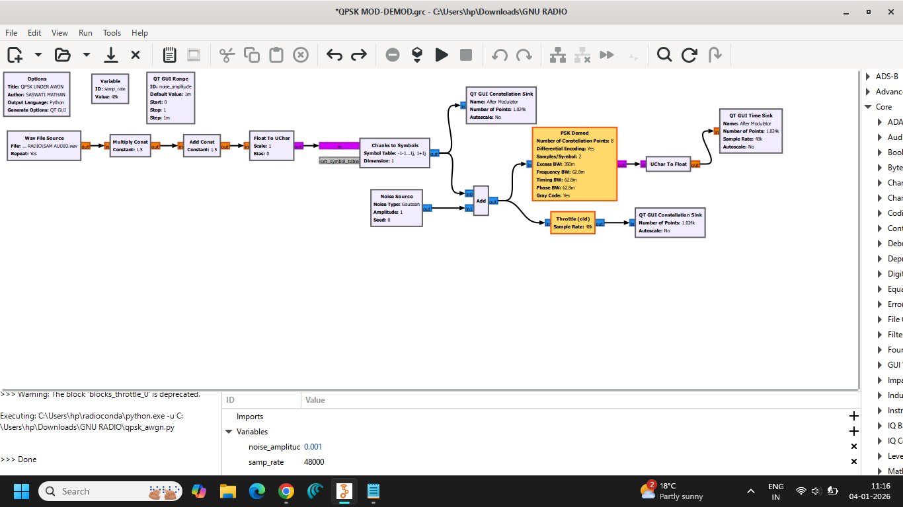

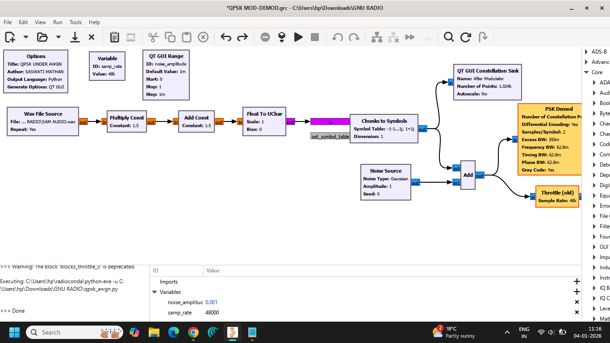

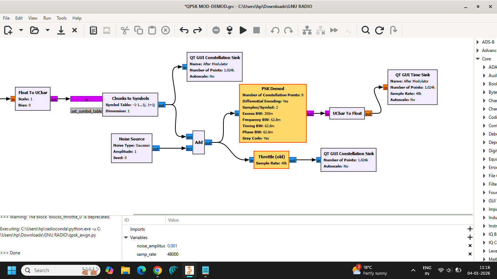

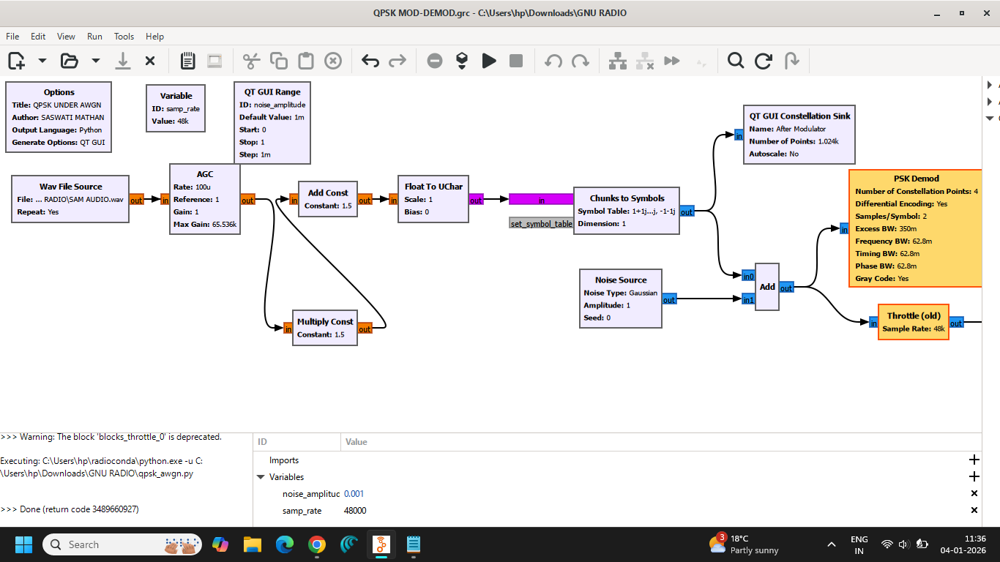

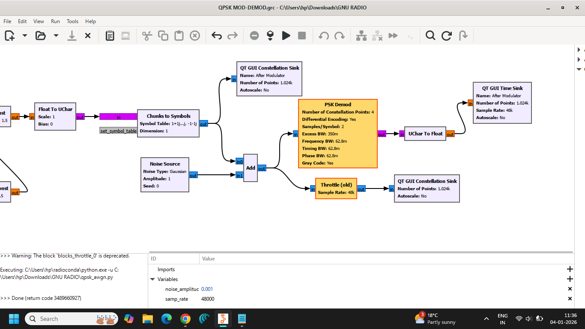

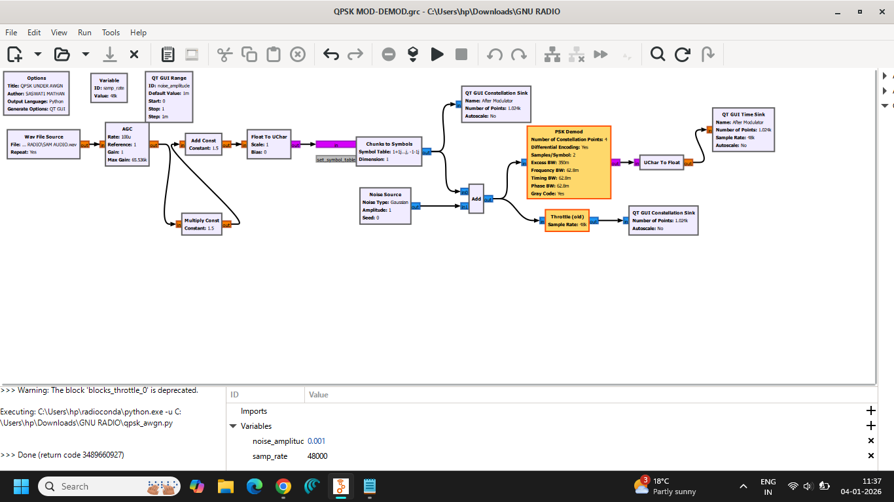

---

## 12. Output Analysis

The QPSK signal and its I/Q characteristics were observed using GNU Radio visualization blocks.

The following screenshots document the observed QPSK signal:

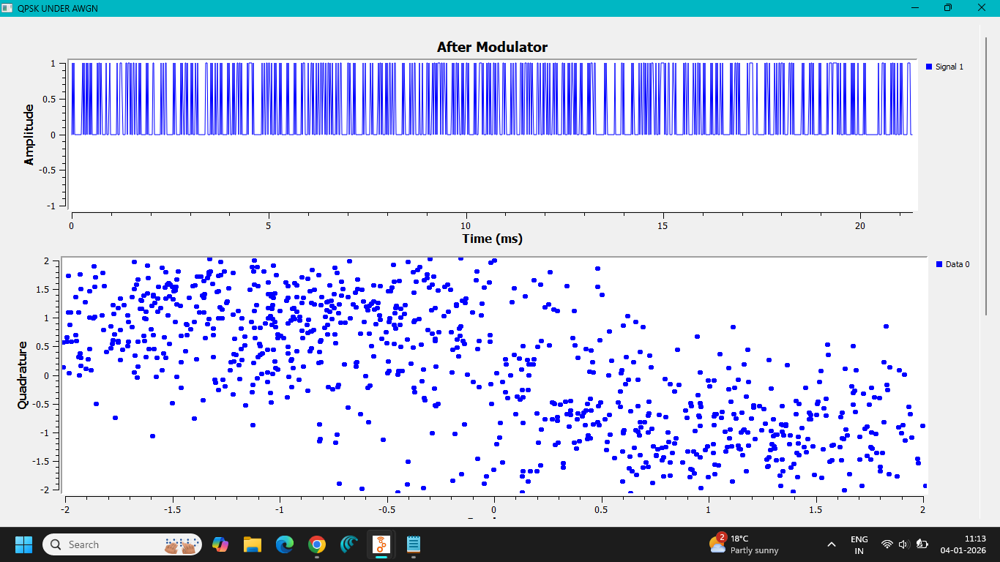

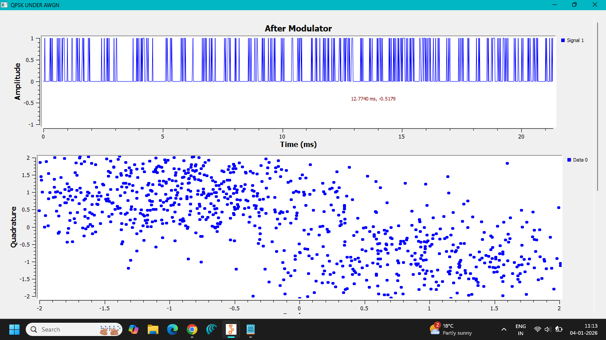

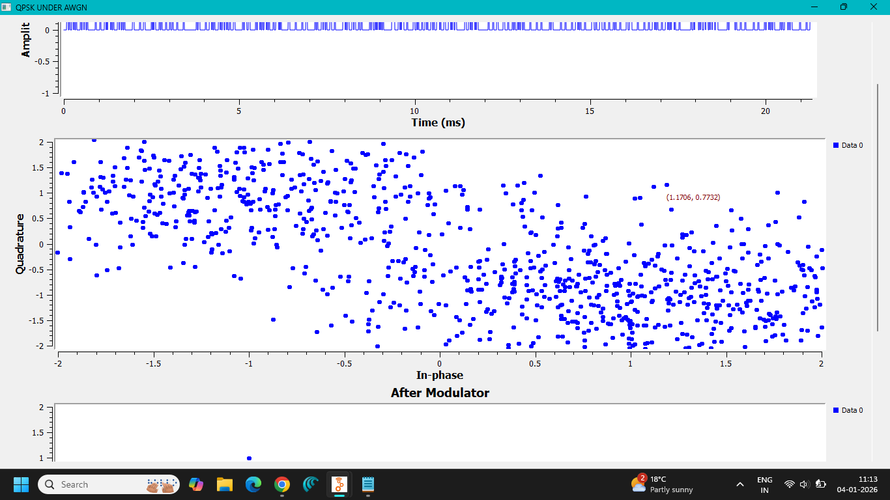

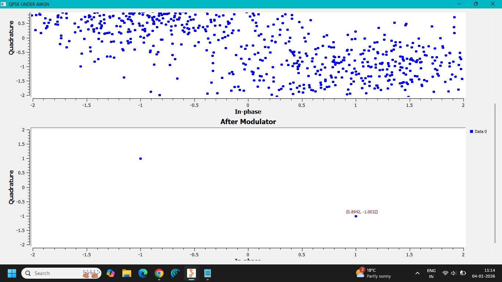

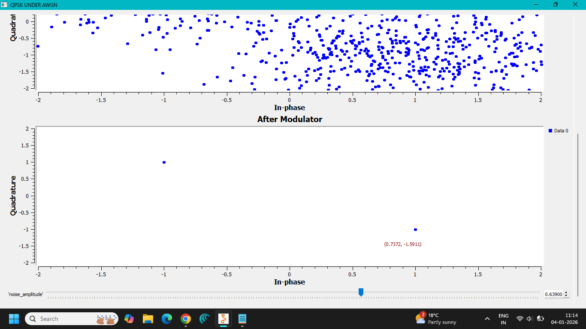

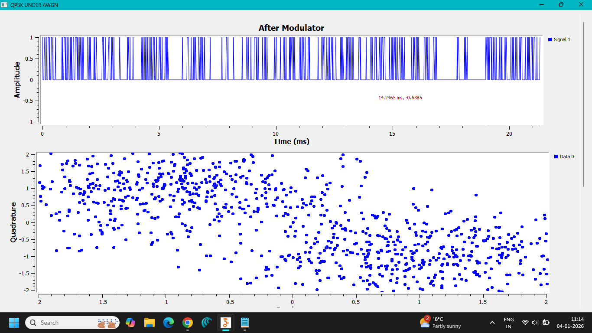

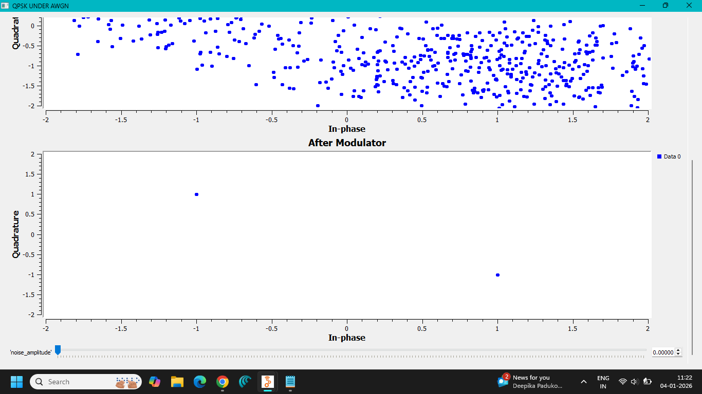

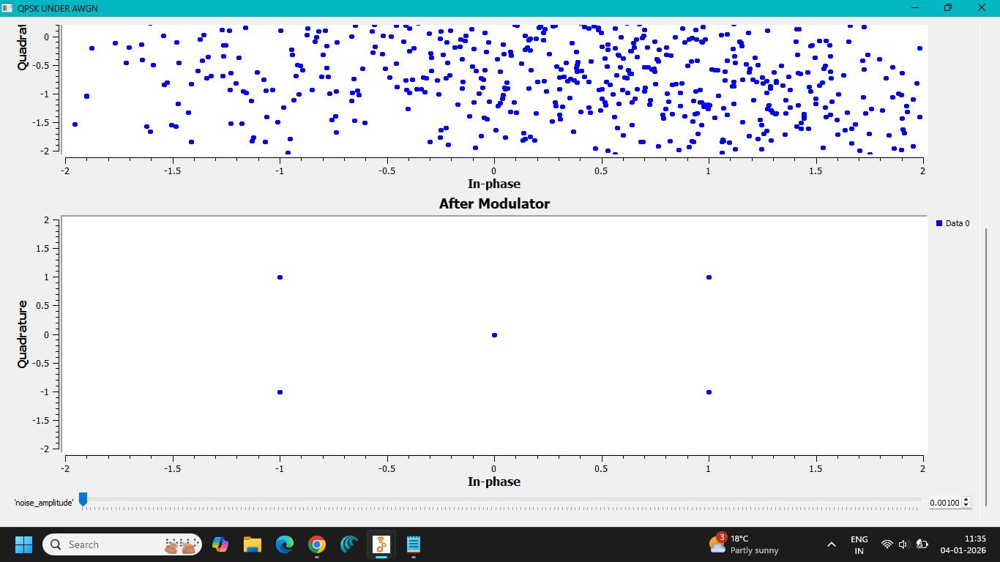

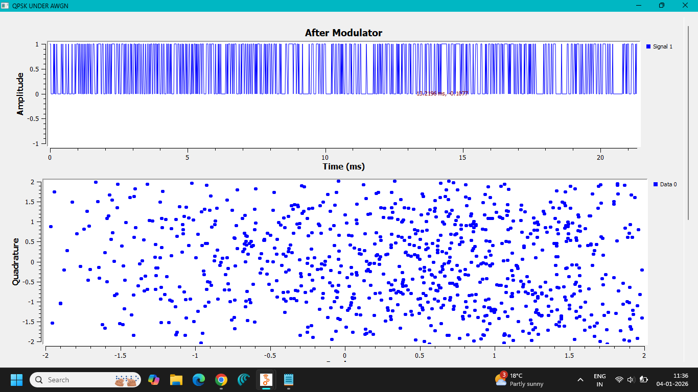


These observations demonstrate the QPSK signal characteristics and the behavior of the I/Q components during modulation and demodulation.

---

## 13. Observations

1. Digital input data was used as the information source.
2. The input data was grouped into pairs of bits.
3. Each two-bit group was mapped to one of four possible phase states.
4. The QPSK signal was generated using orthogonal I and Q components.
5. The signal was passed through an AWGN channel.
6. Noise affected the received signal and caused variations in the observed signal points.
7. The receiver processed the noisy signal to recover the transmitted information.
8. Four distinct phase states were used to represent the four QPSK symbols.
9. QPSK therefore transmitted two bits per symbol.

---

## 14. Files Included

### GNU Radio Flowgraph

```text
flowgraph/
└── QPSK MOD-DEMOD.grc
```

### Generated Python File

```text
python/
└── qpsk_awgn.py
```

### Screenshots

```text
screenshots/
├── AMPLITUDE_QUADARTURE-1.png
├── AMPLITUDE_QUADARTURE-2.png
├── AMPLITUDE_QUADARTURE-3.png
├── AMPLITUDE_QUADARTURE-4.png
├── AMPLITUDE_QUADARTURE-5.png
├── AMPLITUDE_QUADARTURE-6.png
├── AMPLITUDE_QUADARTURE-7.png
├── AMPLITUDE_QUADARTURE-8.png
├── AMPLITUDE_QUADARTURE-9.png
├── AMPLITUDE_QUADARTURE-10.png
├── FLOWGRAPH-1.png
├── FLOWGRAPH-2.png
├── FLOWGRAPH-3.png
├── FLOWGRAPH-4.png
├── FLOWGRAPH-5.png
└── FLOWGRAPH-6.png
```

## 15. Result

**QPSK modulation and demodulation were successfully implemented using GNU Radio Companion.**

The digital input data was converted into QPSK symbols using four distinct phase states. The signal was transmitted through an AWGN channel, and the received signal was processed to recover the transmitted information.

The experiment demonstrated the effect of noise on the QPSK signal and the operation of I/Q-based digital modulation and demodulation.

---

## 16. Conclusion

This experiment demonstrated the fundamental principle of **Quadrature Phase Shift Keying (QPSK)**.

QPSK represents digital information using four different carrier phase states, allowing **two bits to be transmitted per symbol**.

The use of orthogonal in-phase and quadrature components makes QPSK an efficient digital modulation technique. The addition of AWGN demonstrated how channel noise affects the received signal and can influence symbol detection.

GNU Radio provided a practical environment for implementing, visualizing, and analyzing the complete QPSK modulation and demodulation process.

---

**Experiment:** Lab 08 — QPSK Modulation and Demodulation  
**Platform:** GNU Radio Companion
