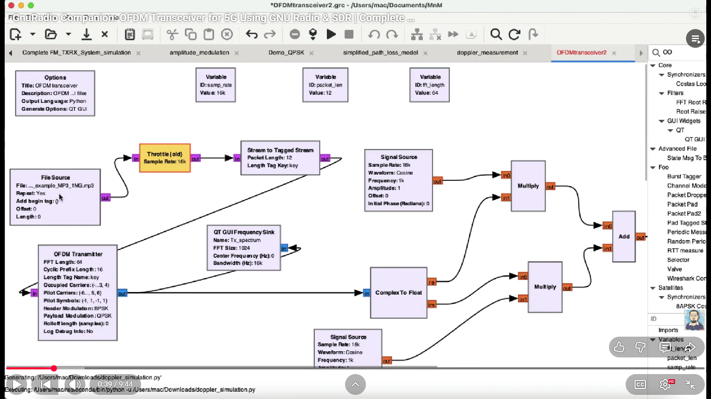
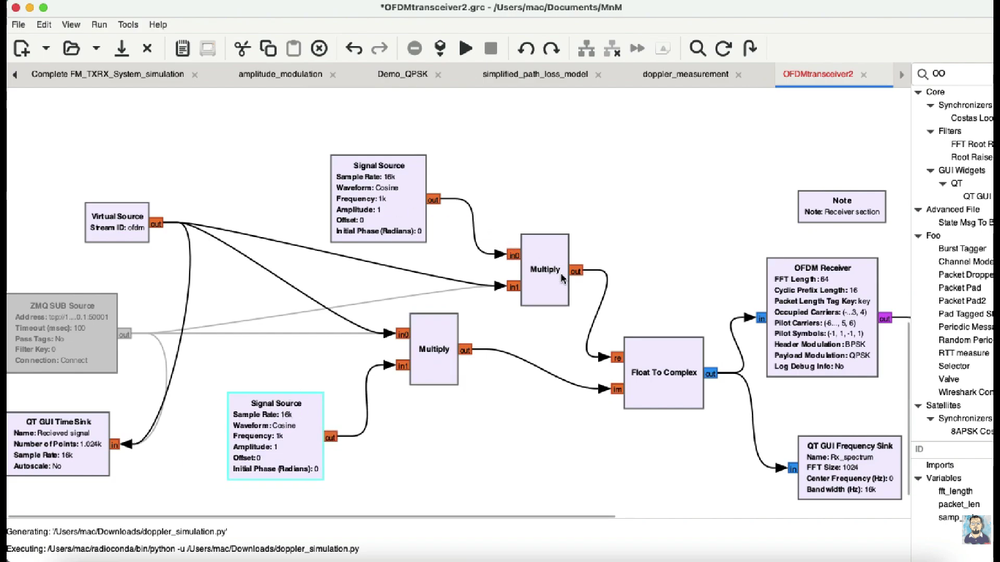
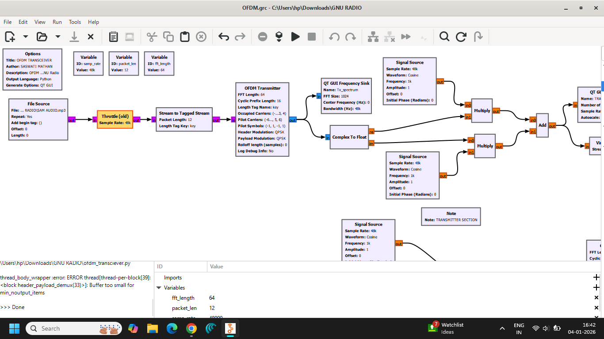
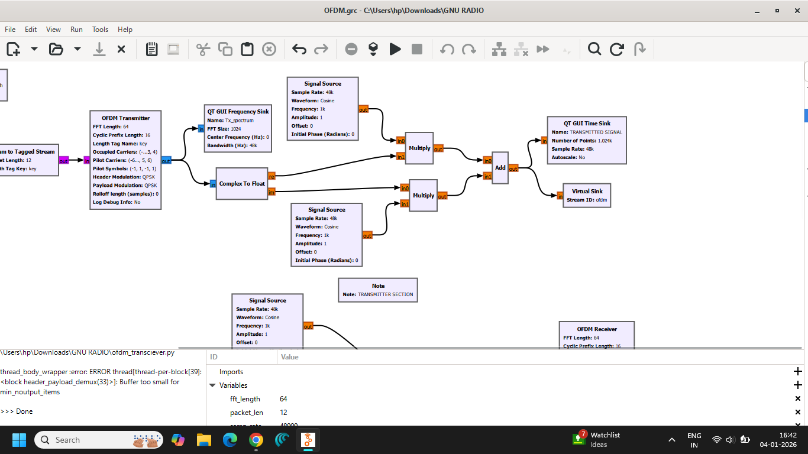
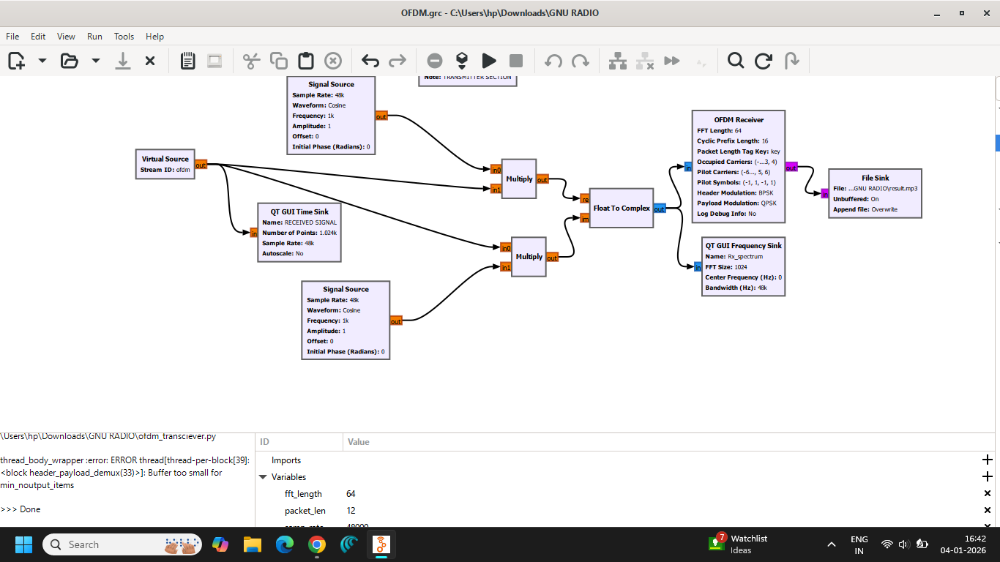
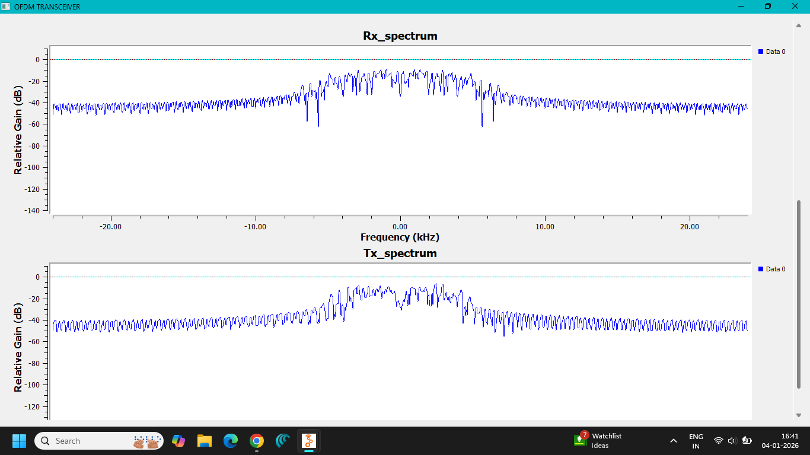
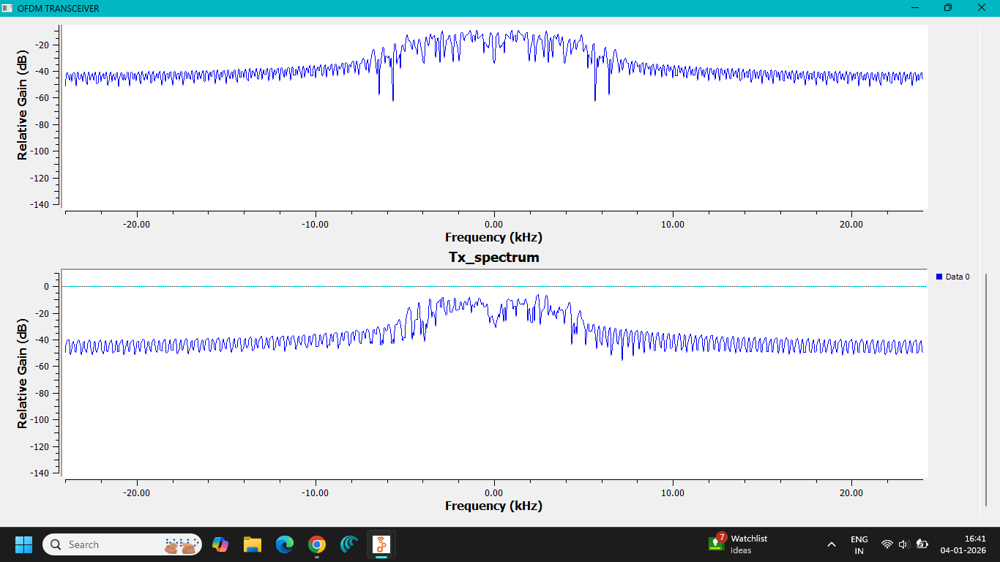

# Lab 09 — Orthogonal Frequency Division Multiplexing (OFDM)

## 1. Objective

To implement and analyze **Orthogonal Frequency Division Multiplexing (OFDM)** using GNU Radio Companion and observe the transmitted and received signals in both time and frequency domains.

---

## 2. Introduction

**Orthogonal Frequency Division Multiplexing (OFDM)** is a multicarrier digital communication technique in which a high-rate data stream is divided into multiple lower-rate parallel streams.

Each parallel stream is transmitted using a separate subcarrier. The subcarriers are carefully spaced so that they remain **orthogonal** to each other.

Because of this orthogonality, the subcarriers can overlap in the frequency domain without causing mutual interference when the system is properly synchronized.

---

## 3. Basic Concept of OFDM

In a conventional single-carrier system, a high data rate is transmitted over one carrier.

In OFDM, the data is divided among multiple subcarriers:

```text
High-Rate Data
      ↓
Parallel Data Streams
      ↓
Multiple Orthogonal Subcarriers
      ↓
OFDM Signal
```

Each subcarrier carries a portion of the transmitted information.

The overall OFDM signal is therefore composed of many closely spaced orthogonal subcarriers.

---

## 4. Orthogonality

The key principle of OFDM is **orthogonality**.

The subcarriers are selected such that the integral of the product of two different subcarriers over one symbol period is zero.

For subcarriers separated by integer multiples of the subcarrier spacing:

$$
\Delta f = \frac{1}{T}
$$

where:

- $\Delta f$ = subcarrier spacing
- $T$ = OFDM symbol duration

This spacing allows the spectra of neighboring subcarriers to overlap while still allowing the receiver to separate them.

---

## 5. OFDM Signal

An OFDM signal can be represented as:

$$
s(t)=\sum_{k=0}^{N-1}X_k e^{j2\pi k\Delta f t}
$$

where:

- $N$ = number of subcarriers
- $X_k$ = data symbol transmitted on the $k$-th subcarrier
- $\Delta f$ = subcarrier spacing
- $t$ = time

The multiple subcarriers are combined to form the complete OFDM waveform.

---

## 6. IFFT and FFT in OFDM

OFDM transmitters commonly use an **Inverse Fast Fourier Transform (IFFT)** to generate the time-domain OFDM signal.

### Transmitter

```text
Input Data
    ↓
Symbol Mapping
    ↓
Parallel Data
    ↓
IFFT
    ↓
OFDM Time-Domain Signal
```

At the receiver, the reverse operation is performed using an **FFT**:

### Receiver

```text
Received OFDM Signal
        ↓
       FFT
        ↓
Parallel Subcarriers
        ↓
Symbol Detection
        ↓
Recovered Data
```
The IFFT efficiently generates the orthogonal subcarriers, while the FFT separates them at the receiver.

---

## 7. Cyclic Prefix

A **Cyclic Prefix (CP)** is commonly added to an OFDM symbol before transmission.

The cyclic prefix helps reduce **Inter-Symbol Interference (ISI)** caused by multipath propagation.

The cyclic prefix is created by copying the end portion of the OFDM symbol and placing it at the beginning.

```text
Original OFDM Symbol
        ↓
[ CP ][ Original OFDM Symbol ]
```
If the cyclic prefix is sufficiently long compared with the channel delay spread, the effect of multipath can be significantly reduced.

---

## 8. Advantages of OFDM

- High spectral efficiency.
- Efficient use of available bandwidth.
- Robustness against multipath propagation.
- Simple frequency-domain equalization.
- Supports high data rates.
- Suitable for broadband wireless communication.
- Orthogonal subcarriers allow efficient spectrum utilization.

---

## 9. Disadvantages of OFDM

- High Peak-to-Average Power Ratio (PAPR).
- Sensitive to frequency offset.
- Sensitive to timing and synchronization errors.
- Requires accurate FFT/IFFT processing.
- Cyclic prefix introduces some overhead.
- Power amplifiers must operate with sufficient linearity.

---

## 10. Applications

OFDM is widely used in modern communication systems, including:

- Wi-Fi
- 4G LTE
- 5G communication systems
- Digital television
- Digital audio broadcasting
- Broadband wireless communication
- DSL and other high-speed communication systems

---

## 11. GNU Radio Implementation

The OFDM transceiver was implemented using **GNU Radio Companion**.

The system processes digital information and distributes it across multiple orthogonal subcarriers. The resulting OFDM signal is transmitted through the simulated communication system and processed at the receiver to recover the transmitted information.

GNU Radio visualization blocks were used to compare the transmitted and received signals and to observe their frequency-domain characteristics.

---

## 12. GNU Radio Flowgraph

The implemented OFDM flowgraph is shown below.











---

## 13. Transmitted and Received Signal Analysis

The transmitted and received signals were observed using GNU Radio visualization blocks.


The comparison demonstrates the behavior of the OFDM signal before and after transmission through the simulated communication system.

---

## 14. Frequency-Domain Analysis

The OFDM spectrum was observed using frequency-domain visualization.





The spectrum demonstrates the presence of multiple closely spaced subcarriers that form the OFDM signal.

The subcarriers overlap in the frequency domain while maintaining orthogonality.

---

## 15. Observations

1. The input data was divided into multiple parallel streams.
2. Multiple subcarriers were used to transmit the data.
3. The subcarriers were orthogonally spaced.
4. The IFFT-based process generated the OFDM time-domain waveform.
5. The receiver processed the received signal to recover the transmitted information.
6. Multiple subcarriers were visible in the frequency-domain representation.
7. The transmitted and received signals could be compared using GNU Radio visualization blocks.

---

## 16. Files Included

### GNU Radio Flowgraph

```text
flowgraph/
└── OFDM.grc
```
### Generated Python File

```text
python/
└── ofdm_transciever.py
```

### Screenshots

```text
screenshots/
├── FLOWGRAPH-1.png
├── FLOWGRAPH-2.png
├── FLOWGRAPH-3.png
├── FLOWGRAPH-4.png
├── FLOWGRAPH-5.png
├── RECEIVED SIGNAL_TRANSMITTED SIGNAL-1.png
├── RECEIVED SIGNAL_TRANSMITTED SIGNAL-2.png
├── RX_TX_SPECTRUM-1.png
└── RX_TX_SPECTRUM-2.png
```

## 17. Result

**OFDM transmission and reception were successfully implemented using GNU Radio Companion.**

The experiment demonstrated the use of multiple orthogonal subcarriers for transmitting digital information. The transmitted and received signals were observed, and the OFDM spectrum was analyzed using GNU Radio visualization tools.

---

## 18. Conclusion

This experiment demonstrated the fundamental principle of **Orthogonal Frequency Division Multiplexing (OFDM)**.

OFDM divides a high-rate data stream among multiple orthogonal subcarriers, providing efficient utilization of the available spectrum and improved robustness against multipath propagation.

The experiment also demonstrated the importance of **IFFT and FFT operations** in OFDM systems and provided practical visualization of transmitted, received, and frequency-domain signals.

GNU Radio provided a practical environment for connecting the theoretical concepts of OFDM with an actual digital communication-system implementation.

---

**Experiment:** Lab 09 — Orthogonal Frequency Division Multiplexing (OFDM)  
**Platform:** GNU Radio Companion
