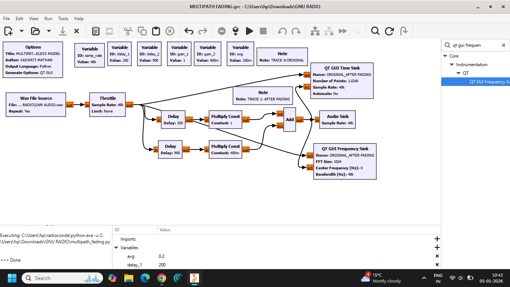
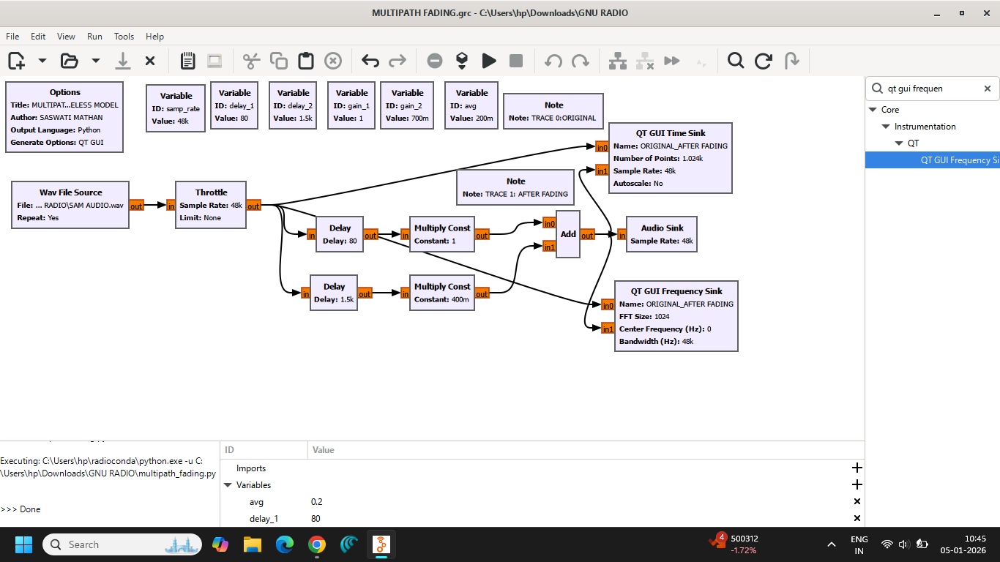
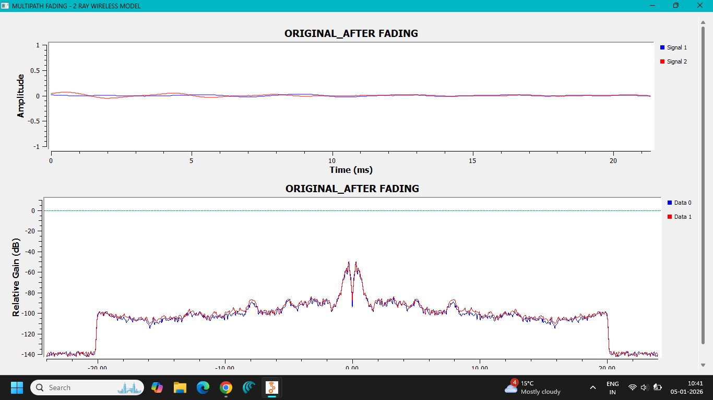
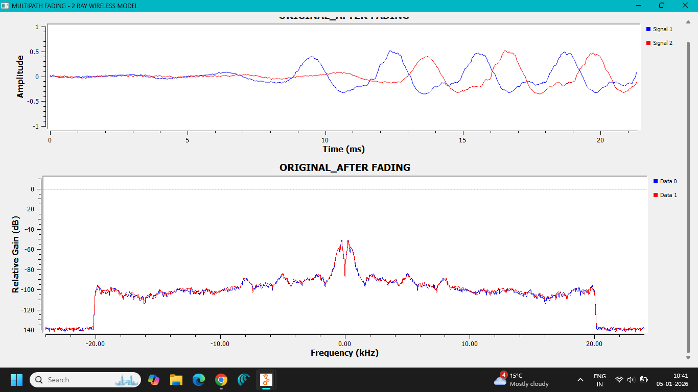
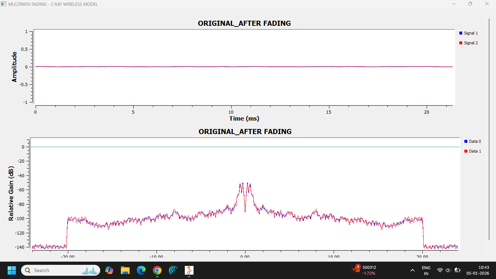
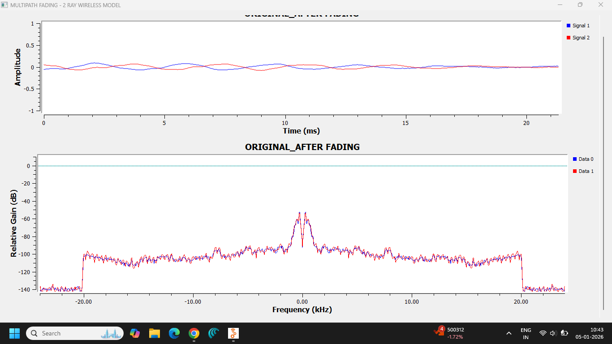
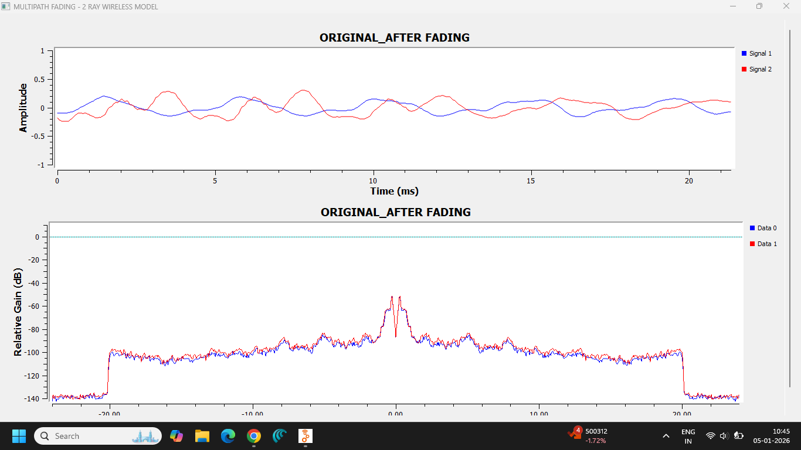
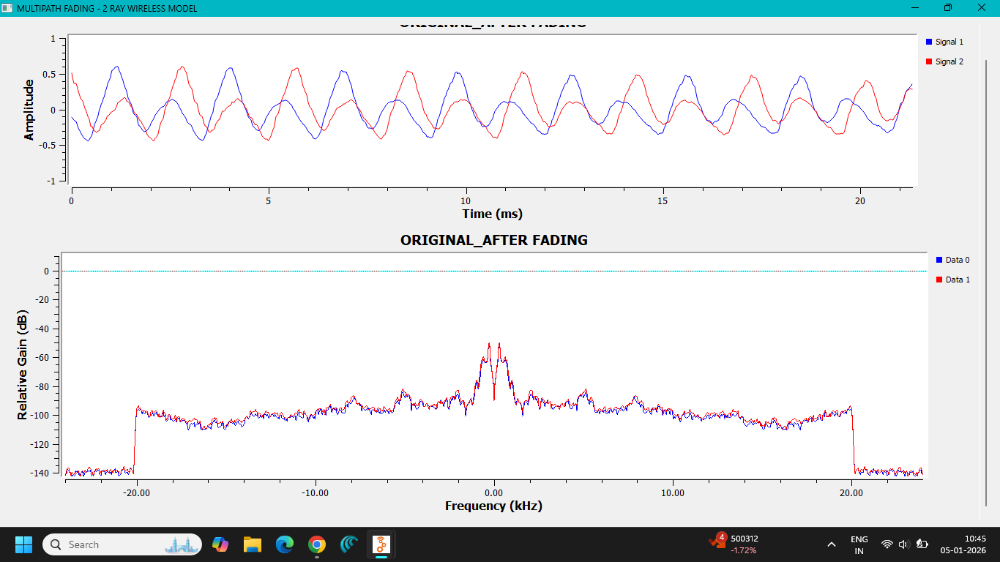

# Lab 10 — Multipath Fading

## 1. Aim

To understand the effect of **multipath propagation and fading** on a communication signal and to analyze the received signal using **GNU Radio Companion**.

---

## 2. Objective

The objectives of this experiment are:

- To understand the concept of multipath propagation.
- To study constructive and destructive interference.
- To observe the effect of different propagation paths on a received signal.
- To understand delay spread and fading.
- To analyze the received signal using GNU Radio visualization tools.

---

## 3. Theory

### Multipath Propagation

In a wireless communication system, a transmitted signal may reach the receiver through multiple propagation paths.

The signal can be reflected, diffracted, or scattered by objects such as:

- Buildings
- Walls
- Vehicles
- Trees
- Ground surfaces
- Other obstacles

As a result, the receiver may receive several copies of the same transmitted signal at different times and with different amplitudes and phases.

This phenomenon is called **multipath propagation**.

```text
                 Reflected Path
                /-------------\
               /               \
Transmitter ---                ---> Receiver
               \               /
                \-------------/
                  Direct Path
```

The received signal is therefore the combination of several delayed and attenuated versions of the transmitted signal.

---

## 4. Mathematical Model of Multipath Channel

A multipath channel can be represented as:

$$
h(t)=\sum_{k=0}^{N-1}\alpha_k\delta(t-\tau_k)
$$

where:

- $N$ = number of propagation paths
- $\alpha_k$ = amplitude coefficient of the $k$-th path
- $\tau_k$ = delay associated with the $k$-th path
- $\delta(t)$ = Dirac delta function

The received signal can be expressed as:

$$
y(t)=x(t)*h(t)
$$

where:

- $x(t)$ = transmitted signal
- $h(t)$ = channel impulse response
- $y(t)$ = received signal
- $*$ = convolution operation

Therefore, the received signal is a combination of delayed and attenuated copies of the transmitted signal.

---

## 5. Fading

**Fading** refers to the variation in the received signal amplitude, phase, or power caused by changes in the propagation environment.

In a multipath environment, different signal copies can combine in two ways.

### Constructive Interference

When the received signal components arrive with similar phases, they reinforce one another.

This produces an increase in received signal amplitude.

```text
Signal 1 + Signal 2
        ↓
Constructive Interference
        ↓
Higher Received Amplitude
```

### Destructive Interference

When signal components arrive with different or opposite phases, they partially or completely cancel each other.

This produces a reduction in received signal amplitude.

```text
Signal 1 + Signal 2
        ↓
Destructive Interference
        ↓
Lower Received Amplitude
```

This variation in signal strength is one of the fundamental causes of wireless fading.

---

## 6. Delay Spread

Because different propagation paths have different lengths, the received signal copies do not arrive at exactly the same time.

The difference between the arrival times of different signal components is called **delay spread**.

A large delay spread can cause:

- Inter-Symbol Interference (ISI)
- Signal distortion
- Reduced communication performance

Delay spread is particularly important in high-data-rate communication systems.

---

## 7. Types of Fading

Multipath fading is commonly classified based on different channel characteristics.

### Flat Fading

In flat fading, the channel affects the transmitted signal approximately equally across its bandwidth.

The signal may experience amplitude and phase variations without significant frequency-selective distortion.

### Frequency-Selective Fading

In frequency-selective fading, different frequency components of the transmitted signal experience different attenuation and phase shifts.

This can cause distortion and inter-symbol interference.

### Slow Fading

Slow fading occurs when the channel characteristics change slowly relative to the transmitted signal.

It is often associated with large-scale environmental changes.

### Fast Fading

Fast fading occurs when the channel changes rapidly due to movement of the transmitter, receiver, or surrounding objects.

---

## 8. Effects of Multipath Fading

Multipath fading can cause:

- Variation in received signal amplitude
- Phase changes
- Signal distortion
- Inter-Symbol Interference (ISI)
- Frequency-selective attenuation
- Reduced signal-to-noise ratio
- Increased bit-error rate
- Communication link degradation

---

## 9. Advantages of Understanding Multipath Fading

Although multipath propagation can degrade communication performance, understanding it is essential for designing robust wireless systems.

It helps in developing techniques such as:

- Diversity reception
- Equalization
- Channel estimation
- Adaptive modulation
- OFDM
- Error-control coding
- MIMO communication

---

## 10. Applications

Multipath fading analysis is important in:

- Mobile communication systems
- Wi-Fi
- LTE
- 5G communication
- Satellite and terrestrial communication
- Wireless sensor networks
- MIMO systems
- OFDM systems
- Radio communication experiments

---

## 11. GNU Radio Implementation

The multipath fading experiment was implemented using **GNU Radio Companion**.

A transmitted signal was passed through a simulated multipath channel containing multiple propagation paths.

Different paths introduced different:

- Amplitudes
- Delays
- Phase shifts

The resulting received signal was analyzed using GNU Radio visualization blocks.

The experiment allows the effect of multipath propagation to be observed directly in the signal waveform and spectrum.

---

## 12. GNU Radio Flowgraph

The implemented multipath fading flowgraph is shown below.

### Flowgraph Screenshot 1



### Flowgraph Screenshot 2


### Flowgraph Screenshot 3



---

## 13. Output Analysis

The received signal was observed after passing through the simulated multipath channel.

The output demonstrates the effect of multiple delayed signal components combining at the receiver.

Depending on the relative phase and delay of the different paths, the received signal may experience:

- Amplitude variations
- Phase variations
- Constructive interference
- Destructive interference
- Signal distortion

The GNU Radio time-domain and frequency-domain displays provide a visual representation of these effects.

### Output Screenshot 1



### Output Screenshot 2



### Output Screenshot 3



### Output Screenshot 4



### Output Screenshot 5



### Output Screenshot 6



---

## 14. Observations

1. The transmitted signal was passed through a simulated multipath channel.
2. Multiple propagation paths were introduced between the transmitter and receiver.
3. The different paths produced delayed and attenuated copies of the transmitted signal.
4. The copies combined at the receiver.
5. Constructive interference increased the received signal amplitude at some instants.
6. Destructive interference reduced the received signal amplitude at other instants.
7. The received waveform differed from the original transmitted waveform.
8. Multipath propagation can introduce delay spread and signal distortion.
9. The received signal characteristics depend on the amplitude, delay, and phase of each propagation path.

---

## 15. Files Included

### GNU Radio Flowgraph

```text
flowgraph/
└── MULTIPATH FADING.grc
```

### Generated Python File

```text
python/
└── multipath_fading.py
```

### Screenshots

```text
screenshots/
├── FLOWGRAPH-1.png
├── FLOWGRAPH-2.png
├── FLOWGRAPH-3.png
├── OUTPUT-1.png
├── OUTPUT-2.png
├── OUTPUT-3.png
├── OUTPUT-4.png
├── OUTPUT-5.png
└── OUTPUT-6.png
```

---

## 16. Result

**Multipath fading was successfully implemented and analyzed using GNU Radio Companion.**

The experiment demonstrated how multiple delayed and attenuated copies of a transmitted signal combine at the receiver.

The received signal exhibited variations caused by constructive and destructive interference, demonstrating the fundamental effect of multipath propagation in wireless communication systems.

---

## 17. Conclusion

This experiment demonstrated the fundamental concept of **multipath fading** in wireless communication.

A transmitted signal can reach the receiver through multiple propagation paths due to reflection, diffraction, and scattering. These signal copies arrive with different amplitudes, phases, and delays and combine at the receiver.

Depending on their relative phases, the received components can produce constructive or destructive interference, resulting in variations in received signal strength and possible signal distortion.

The experiment also demonstrated the importance of understanding **delay spread, fading, and multipath propagation** when designing modern wireless communication systems.

GNU Radio provided a practical environment for visualizing the effects of a multipath channel and connecting the theoretical concepts of wireless propagation with an actual signal-processing implementation.
